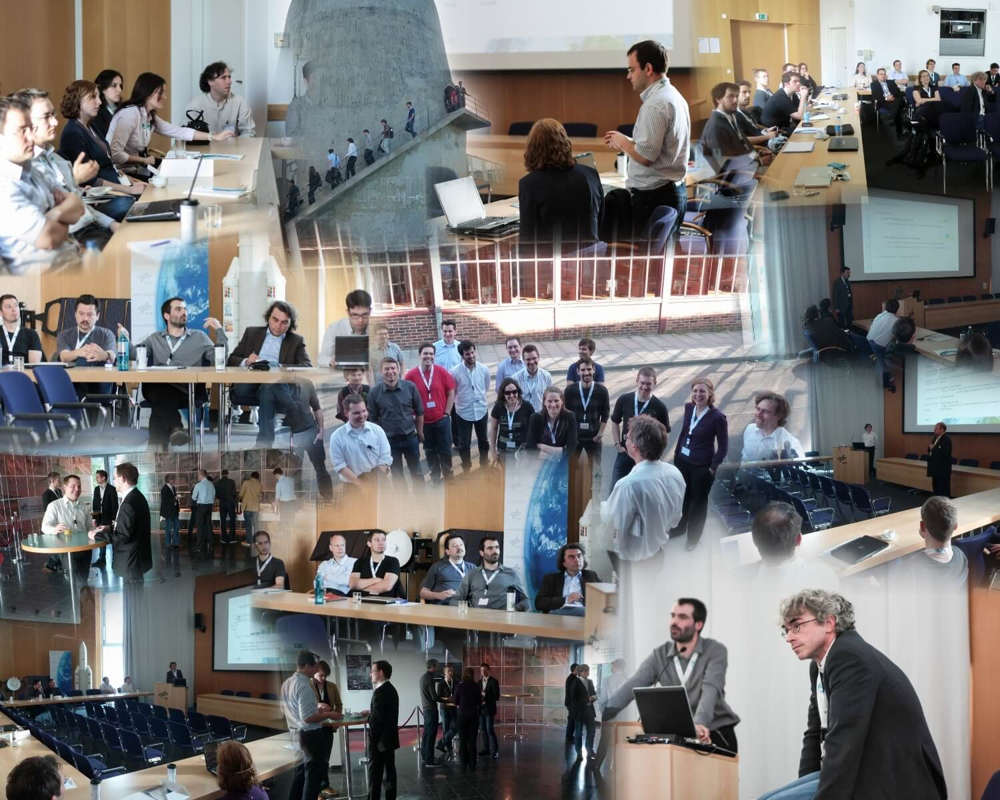

# Introduction
The first SUMO User Conference "SUMO2013" was attended by 30 participants from throughout Europe which presented three days of simulation results but also technical enhancements and new usage scenarios of the open source microscopic traffic simulation. The highlights were two keynote speakers, Christoph Sommer (Universitaet Innsbruck) and Kai Nagel (TU Berlin), which talked about the current developments in the simulation of vehicle communication, one of the main applications of SUMO, as well as experience with the development of MatSim. The program was rounded off by numerous discussions on the edge and a panel discussion, which will promote further exchanges among other simulation scenarios.

The [Springer postproceedings issue of LNCS](http://www.springer.com/de/book/9783662450789) is now online. The updated [conference proceedings](https://elib.dlr.de/97715/1/Proceeding_SUMO2013_15-17May%202013_Berlin-Adlershof.pdf) are available for download as well.

All those who contributed to the SUMO2013 conference: Thank you for all your excellent work!

This conference was a great success! So many people have contributed in so many ways to turn this event into a smoothly running meeting with many very interesting presentations and a very good atmosphere for discussion and networking.

Here are some impression of the SUMO2013

<!-- image -->

  

# Conference Information
Traffic simulations are of immense importance for researchers as well as practitioners in the field of transportation. SUMO has been available since 2001 and provides a wide range of traffic planing and simulation applications. SUMO consists of a suite of tools covering road network imports and enrichment, demand generation and assignment and a state-of-the-art microscopic traffic simulation capable to simulate private and public transport modes, as well as person-based trip chains. Being open, SUMO is also ready to implement new behavioral models or to control the simulation remotely using various programming environments.

These and other features make SUMO one of the most used traffic simulations with a large and international user community. Further information about SUMO can be found at the project's web pages located at <https://eclipse.dev/sumo/>.

The conference aims on exchanging experience in using SUMO, and presenting results or solutions obtained using the software. We expect a large variety of research topics and usage approaches. If you are doing a research project with SUMO and want to present your results please submit an abstract.

There is [a flyer containing most of the important informations](../documents/2013/SUMO2013.pdf). You can find [the detailed program here](../documents/2013/Program_SUMO2013.pdf).

# Contact
Please contact the conference team via mail at [sumo-conference@dlr.de](mailto:sumo-conference@dlr.de)

The postal address is:

German Aerospace Center
Institute of Transportation Systems
Rutherfordstr. 2
12489 Berlin
Germany
