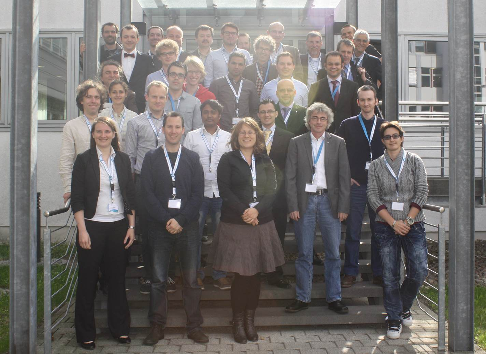

  <a href="https://elib.dlr.de/97714/1/SUMO2015_Proceeding.pdf" class="btn btn-info btn-sm btn-padding"><i class="fas fa-file-download"></i> SUMO 2015 Proceedings (17.07 MB)</a>
  <a href="../documents/2015/SUMO2015.pdf" class="btn btn-info btn-sm btn-padding"><i class="fas fa-file-download"></i> SUMO 2015 Flyer (1.42 MB)</a>

# Introduction
The SUMO2015 Conference was attended by over 40 participants from throughout Europe and America which presented two days of simulation results but also technical enhancements and new usage scenarios of the open source microscopic traffic simulation (Here you can find the conference proceedings). A highlight were the keynote speakers Fritz Busch (Technische Universität München) and Hans van Lint (Delft University of Technology). The program was rounded off by numerous discussions on the edge and the SUMO Café, which will promote further exchanges among other simulation scenarios.

All those who contributed to the SUMO2015 conference:   
Thank you for all your excellent work!

This conference was a great success! So many people have contributed in so many ways to turn this event into a smoothly running meeting with many very interesting presentations and a very good atmosphere for discussion and networking.

<!-- image -->

  

# Conference Information
Traffic simulations are of immense importance for researchers as well as practitioners in the field of transportation. SUMO has been available since 2001 and provides a wide range of traffic planning and simulation applications. SUMO consists of a suite of tools covering road network imports and enrichment, demand generation and assignment and a state-of-the-art microscopic traffic simulation capable to simulate private and public transport modes, as well as person-based trip chains. Being open, SUMO is also ready to implement new behavioral models or to control the simulation remotely using various programming environments. These and other features make SUMO one of the most used traffic simulations with a large and international user community. Further information about SUMO can be found at the project's web pages located at <https://sumo.dlr.de/>.

# Contact
Please contact the conference team via mail at [sumo-conference@dlr.de](mailto:sumo-conference@dlr.de)