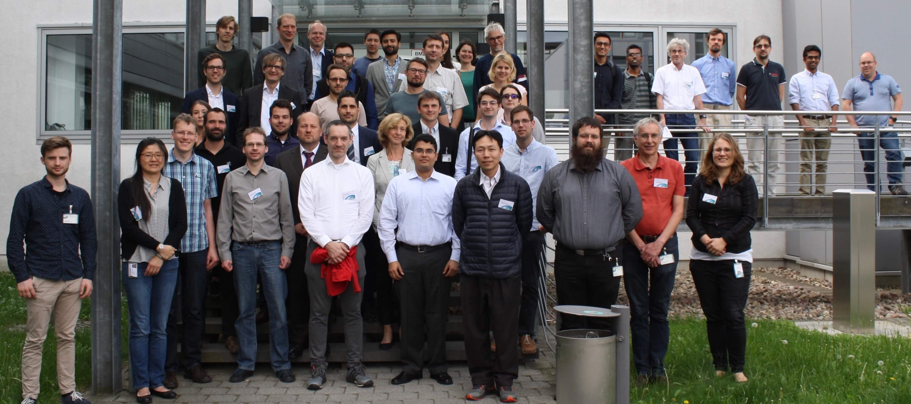

<!-- image -->

  

### Introduction
Traffic simulations are of immense importance for researchers as well as practitioners in the field of transportation. SUMO has been available since 2001 and provides a wide range of traffic planning and simulation applications. SUMO consists of a suite of tools covering road network imports and enrichment, demand generation and assignment and a state-of-the-art microscopic traffic simulation capable to simulate private and public transport modes, as well as person-based trip chains. Being open source, SUMO is ready to implement new behavioral models or to control the simulation remotely using various programming environments. These and other features make SUMO one of the most often used open source traffic simulations with a large and international user community.

The conference was a great success! So many people have contributed in many ways to turn this event into a well-organized meeting with very interesting presentations and lively discussions.

All those who contributed to the SUMO User Conference 2018:   
Thank you for your excellent work!

### Contact
Please contact the conference team via mail at [sumo-conference@dlr.de](mailto:sumo-conference@dlr.de)   
You can find more information about SUMO at <https://sumo.dlr.de>