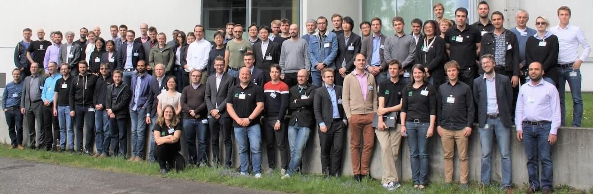

<!-- head image -->

  

# Introduction
Traffic simulations are of immense importance for researchers as well as practitioners in the field of transportation. Eclipse SUMO provides a wide range of traffic planning and simulation applications. Eclipse SUMO is a toolsuite covering road network imports and enrichment, demand generation and assignment and a state-of-the-art microscopic traffic simulation capable to simulate private and public transport modes, as well as person-based trip chains. Being open source, Eclipse SUMO is ready to implement new behavioral models or to control the simulation remotely using various programming environments. These and other features make Eclipse SUMO one of the most often used open source traffic simulations with a large and international user community.

# Call for Papers
The conference aims on presenting new and unique results in the field of mobility simulation and modelling using openly available tools and data. We expect a large variety of research topics and usage approaches. If you are doing a research project fitting the topics below you are kindly invited to submit an abstract. Possible areas of interest include (but are not limited to):  

- Vehicular Communication
- Modelling Urban Mobility
- Intermodal Transport
- Autonomous Driving
- Logistics Simulation
- Mobility Modelling
- Traffic Simulation
- Traffic Applications
- Traffic Management Solutions
- Open Tools and Open Data
- E-Mobility
- Autonomous Driving

Authors are requested to register at Easy Chair <https://easychair.org/conferences/?conf=sumo2019>.

Instructions for authors and a template can be found here: <https://easychair.org/publications/for_authors>. 

# Keynote Speaker
[Peter Vortisch](https://www.ifv.kit.edu/mitarbeiter_158.php) (KIT – Institut für Verkehrswesen IfV)

# Prices

- Regular Tickets – 495 EUR
- One-Day-Ticket – 325 EUR
- Authors and Project Partners – 275 EUR
- "limited" Student Grants - 50 EUR

# Sessions and Presentations

**Session 1: Automated Vehicles**

- Coupling SUMO with a Motion Planning Framework for Automated Vehicles
- Emission Effects of Cooperative Adaptive Cruise Control
- SUMO Based Platform for Cooperative Intelligent Automotive Agents
- From Automated to Manual - Modeling Control Transitions with SUMO

---

**Session 2: Connected Vehicles**

- Controlling a real-world intersection with connected vehicle information provided by CAMs (Cooperative Awareness Messages)
- Bridging the Gap between SUMO & Kuksa: Using A Traffic Simulator for Testing Cloud-based Connected Vehicle Services
- Anticipating automated vehicle presence and the effects on interactions with conventional traffic and infrastructure

---

**Keynote**

- Traffic Simulation between Traffic Engineering and Automotive - Prof. Dr. Peter Vortisch

---

**Session 3: Simulator Coupling**

- Co-simulation of the virtual vehicle in virtual traffic considering tactical driver decisions
- Co-simulation of vehicles and crowds for rescue trials
- Recurrent and Non-recurrent Congestion based Gridlock Detection on Chula-SSS Urban Road Network
- Queue length estimation through a simple V2V communication protocol

---

**Session 4: Traffic Light systems**

- Pedestrian-Friendly Traffic Signal Control Using SUMO
- Remarks on Traffic Signal Coordination
- Modelling green waves for emergency vehicles using connected traffic data      

---

**Session 5: Other traffic Modes**

- Investigation of the capacity of train stations in case of a large-scale emergency evacuation
- A Vehicle Device Tailored for Hybrid Trolleybuses and Overhead Power Lines Implementation in SUMO
- Modelling Bicycle Infrastructure in SUMO
- Analysing bicyclist behaviour using a bicycle simulator with a coupled traffic and environment simulation
- Testing an Adaptive Cruise Controller with coupled traffic and driving simulations

---

**Session 6: New Tools**

- Estimation and prediction of traffic dynamics with data-driven low-dimensional model based on SUMO
- Introducing Road Surface Conditions into a Microscopic Traffic Simulation
- Reinforcement Learning Agent under Partial Observability for Traffic Light Control in Presence of Gridlocks

# Registration
The registration fee includes a two and a half day conference program with refreshments, lunch, proceedings and social events in the evening. Accommodation is not included within the registration fee and must be pre-booked separately. **Register [here](https://sumo2019.besl-eventservice.de/front/index.php)**.

# Language
The conference language is English.

# Social Event
We are having a social event on Monday May 13 at BTB (<https://www.btb-berlin.de/>), 2019 at 6 p.m. and on Tuesday May 14, 2019 (barbecue at the DLR Berlin-Adlershof).

# Venue
German Aerospace Center   
Institute of Transportation Systems   
Rutherfordstr. 2   
12489 Berlin   
Germany

# Contact
Please contact the conference team via mail at [sumo-conference@dlr.de](mailto:sumo-conference@dlr.de)   
You can find more information about SUMO at <https://sumo.dlr.de>

---

**INFORMATION ABOUT THE NEW EU GENERAL DATA PROTECTION (GDPR)   
DATENSCHUTZGRUNDVERORDNUNG (DGSVO)**

You may have heard about the new General Data Protection Regulation ("GDPR") that came into effect May 25, 2018. To help comply with GDPR consent requirements, we need to inform you that the publication or data processing will not take place unless prior written consent for photography, publication of photographs and dissemination of personal data for the sending of informational emails has been received.

 If you want to continue receiving E-mails from the German Aerospace Center (DLR), Institute of Transportation Systems, Berlin-Adlershof Germany, please sign at the registration desk the “Declaration of consent for the publication of photographs and dissemination of information”.

Thank you!