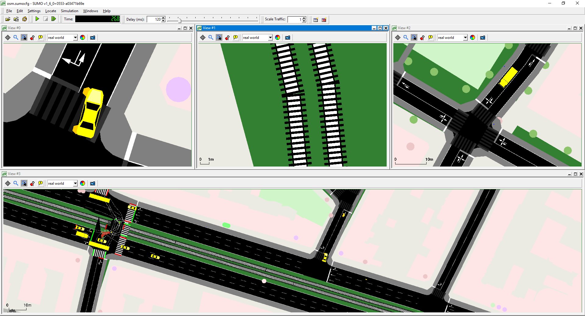
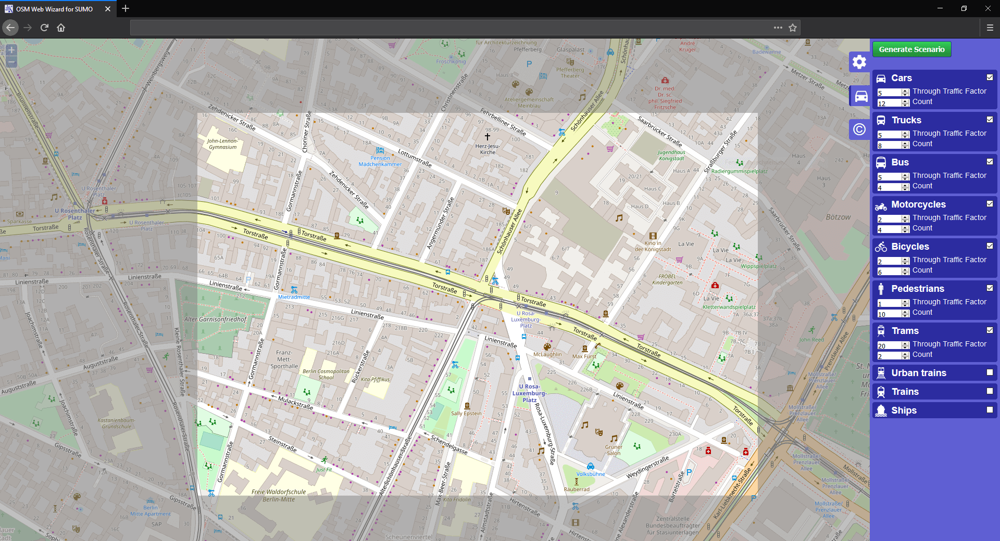
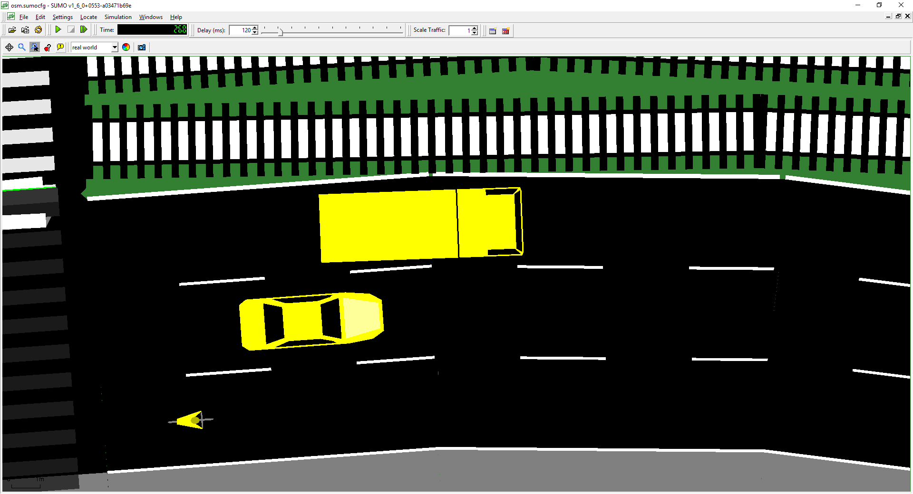
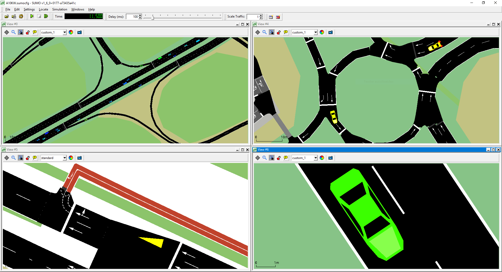

<div class="container"><div class="row"><div class="col-md-12 contact-div">

Eclipse SUMO is a free and open source traffic simulation suite. It was started in 2001 by employees of the <a href="https://www.dlr.de/ts">Institute of Transportation Systems</a> at the <a href="https://www.dlr.de/">German Aerospace Center (DLR)</a>. SUMO allows modelling of intermodal traffic systems - including road vehicles, public transport and pedestrians. Included with SUMO is a wealth of supporting tools that automate core tasks for the creation, the execution and evaluation of traffic simulations, such as network import, route calculations, visualization and emission calculation. SUMO can be enhanced with custom models and provides various APIs to remotely control the simulation.

In 2018 SUMO became <a href="https://projects.eclipse.org/projects/automotive.sumo">a project at the Eclipse Foundation</a>. Today, the main development continues to be driven by employees at the DLR, with contributions from our growing user community!

<br>

<!-- Computer vector-image and screenshots -->
<center><div id="not_for_ie" class="col-sm-8 device-laptop">
<svg viewBox="0 0 707.42 398.84" class="computer-container transparent"> <defs id="defs66"> <linearGradient gradientUnits="userSpaceOnUse" gradientTransform="matrix(.99992 0 0 .86395 1.2423 49.596)" y2="472.52" y1="465.67" x2="359.08" x1="359.08" id="q"> <stop id="stop2" offset="0" stop-opacity=".70085" /> <stop id="stop4" offset="1" stop-opacity="0" stop-color="#4b5151" /> </linearGradient> <linearGradient id="p"> <stop id="stop7" offset="0" stop-color="#b3b3b3" /> <stop id="stop9" offset=".02" stop-color="#e9e9e9" /> <stop id="stop11" offset=".04" stop-color="#d4d4d7" /> <stop id="stop13" offset=".96" stop-color="#e4e4e6" /> <stop id="stop15" offset=".98" stop-color="#f4f4f4" /> <stop id="stop17" offset="1" stop-color="#b3b3b3" /> </linearGradient> <linearGradient id="o"> <stop id="stop20" offset="0" stop-color="#fff" /> <stop id="stop22" offset="1" stop-opacity=".8547" stop-color="#fff" /> </linearGradient> <radialGradient xlink:href="#o" gradientUnits="userSpaceOnUse" gradientTransform="matrix(1.2563,0,0,1.193485,-112.702,-103.27702)" r="3.4688" cy="101.43" cx="368.78" id="ab" /> <linearGradient xlink:href="#p" gradientUnits="userSpaceOnUse" gradientTransform="matrix(1.0024,0,0,0.73748,-19.2353,49.311)" y2="438.17" y1="438.17" x2="724.58" x1="19.123" id="r" /> <linearGradient gradientUnits="userSpaceOnUse" gradientTransform="matrix(1.0295,0,0,1.0095,-29.15,-87.1725)" y2="414.62" y1="35.017" x2="468.94" x1="423.08" id="s"> <stop id="stop27" offset="0" stop-color="#91404b" /> <stop id="stop29" offset=".40632" stop-color="#a3466f" /> <stop id="stop31" offset=".69016" stop-color="#915378" /> <stop id="stop33" offset="1" stop-color="#7d4984" /> </linearGradient> <linearGradient gradientUnits="userSpaceOnUse" gradientTransform="matrix(0.99992,0,0,0.86395,-16.8997,-34.053)" y2="472.52" y1="465.67" x2="359.08" x1="359.08" id="t"> <stop id="stop36" offset="0" stop-color="#c6c6c6" /> <stop id="stop38" offset="1" stop-color="#f2f2f2" /> </linearGradient> <linearGradient gradientUnits="userSpaceOnUse" gradientTransform="matrix(1.0083,0,0,0.76407,-21.24,20.861)" y2="485.04" y1="470.3" x2="334.45" x1="334.45" id="u"> <stop id="stop41" offset="0" stop-color="#d1d4d6" /> <stop id="stop43" offset=".5" stop-color="#a1a5a6" /> <stop id="stop45" offset="1" /> </linearGradient> <linearGradient xlink:href="#q" gradientUnits="userSpaceOnUse" gradientTransform="matrix(-1.0006,0,0,0.84879,718.068,-26.836)" y2="467.14" y1="467.8" x2="317.67" x1="310.54" id="v" /> <linearGradient xlink:href="#q" gradientUnits="userSpaceOnUse" gradientTransform="matrix(0.99992,0,0,0.86395,-16.8276,-34.066)" y2="467.14" y1="467.8" x2="317.67" x1="310.54" id="w" /> <linearGradient xlink:href="#p" gradientUnits="userSpaceOnUse" gradientTransform="matrix(0.99957,0,0,1,-18.191558,-83.51254)" y2="455.96" y1="455.96" x2="725.5" x1="18.2" id="x" /> <linearGradient gradientUnits="userSpaceOnUse" gradientTransform="matrix(1,0,0,2.3955,-18.142,-731.839)" y2="464.07" y1="464.07" x2="725.14" x1="18.142" id="y"> <stop id="stop51" offset="0" stop-opacity="0" stop-color="#cfcfcf" /> <stop id="stop53" offset=".5" stop-opacity=".84615" stop-color="#fff" /> <stop id="stop55" offset="1" stop-opacity="0" stop-color="#cfcfcf" /> </linearGradient> <linearGradient gradientUnits="userSpaceOnUse" gradientTransform="matrix(1.4772,0,0,0.89908,-204.002,-39.26)" y2="450.9" y1="439.86" x2="350.38" x1="350.38" id="z"> <stop id="stop58" offset="0" /> <stop id="stop60" offset=".5" stop-color="#4e4e4e" /> <stop id="stop62" offset="1" stop-color="#212121" /> </linearGradient> <linearGradient xlink:href="#o" gradientUnits="userSpaceOnUse" gradientTransform="matrix(1.3271,0,0,1.0058,-232.552,-81.4975)" y2="423.04" y1="97.768" x2="656.6" x1="525.28" id="aa" /> </defs> <g transform="matrix(1.0058955,0,0,0.8856864,-1.8760864,27.669255)" id="g150"> <rect style="fill:#d0d0d2;stroke:#b3b7b7;stroke-width:2;stroke-linecap:round;stroke-linejoin:bevel" id="rect68" ry="20.788" rx="19.999001" height="377.98999" width="542.42999" y="1.000002" x="82.888" /> <rect style="stroke:#000000;stroke-width:1.0088;stroke-linecap:round;stroke-linejoin:bevel" id="rect70" ry="17" rx="17" height="368.17001" width="535.76001" y="4.6169987" x="85.768005" /> <path inkscape:connector-curvature="0" style="opacity:0.16418;fill:url(#ab);stroke-width:1.2563" id="path76" d="m 354.95567,16.930536 a 4.359361,4.1414432 0 1 1 -8.71872,0 4.359361,4.1414432 0 1 1 8.71872,0 z" /> <rect style="fill:url(#r);stroke:url(#x);stroke-width:0.80483;stroke-linecap:round;stroke-linejoin:bevel" id="rect78" height="15.965" width="706.20001" y="364.47101" x="0.40200064" /> <path inkscape:connector-curvature="0" style="opacity:0.87065;fill:url(#t)" id="path80" d="m 297.028,364.011 v 1.5366 c 0,4.788 4.46,8.6421 10,8.6421 h 86.93 c 5.54,0 10,-3.8541 10,-8.6421 v -1.5366 z" /> <rect style="fill:url(#y)" id="rect82" height="2" width="707" y="378.841" x="1.9836426e-07" /> <path inkscape:connector-curvature="0" style="opacity:0.87065;fill:url(#v)" id="path84" d="m 403.938,364.241 v 1.5096 c 0,4.7039 -4.4629,8.4904 -10.007,8.4904 h -86.987 c -5.5436,0 -10.007,-3.7865 -10.007,-8.4904 v -1.5096 h 107 z" /> <path inkscape:connector-curvature="0" style="opacity:0.87065;fill:url(#w)" id="path86" d="m 297.098,364.001 v 1.5366 c 0,4.788 4.46,8.6421 10,8.6421 h 86.93 c 5.54,0 10,-3.8541 10,-8.6421 v -1.5366 z" /> <path inkscape:connector-curvature="0" style="fill:url(#u)" id="path88" d="m 0.4,380.821 c 6.2184,4.8804 30.22,6.9503 39.6,7 216.02,0.0348 620,0 620,0 7.65,9.4e-4 43.32,-3.2917 46.6,-7 z" /> <rect style="opacity:0.27917;fill:none;stroke:#ffffff;stroke-linecap:round;stroke-linejoin:bevel" id="rect90" ry="16.131001" rx="16.93" height="349.35001" width="533.56" y="5.1540012" x="86.828003" /> <rect style="fill:url(#z)" id="rect92" height="7.1926999" width="443.17001" y="356.211" x="129.748" /> </g> </svg>


<div id="sumoScreenshots" class="carousel computer-screenshot" data-ride="carousel">
  <div class="carousel-inner">
    <div class="carousel-item active">
      
    </div>
    <div class="carousel-item">
      
    </div>
    <div class="carousel-item">
      
    </div>
    <div class="carousel-item">
      
    </div>
    <div class="carousel-item">
      
    </div>
    <div class="carousel-item">
      
    </div>
  </div>
  <a class="carousel-control-prev" href="#sumoScreenshots" aria-label="previous image" data-slide="prev">
    <span class="carousel-control-prev-icon"></span>
  </a>
  <a class="carousel-control-next" href="#sumoScreenshots" aria-label="next image" data-slide="next">
    <span class="carousel-control-next-icon"></span>
  </a>
</div>

</div></center>

<br>

# Application Areas

SUMO has been used within several projects for answering a large variety of research questions:

- Evaluate the performance of traffic lights, including the evaluation of modern algorithms up to the evaluation of weekly timing plans.
- Vehicle route choice has been investigated, including the development of new methods, the evaluation of eco-aware routing based on pollutant emission, and investigations on network-wide influences of autonomous route choice.
- SUMO was used to provide traffic forecasts for authorities of the City of Cologne during the Pope’s visit in 2005 and during the Soccer World Cup 2006.
- SUMO was used to support simulated in-vehicle telephony behavior for evaluating the performance of GSM-based traffic surveillance.
- SUMO is widely used by the V2X community for both, providing realistic vehicle traces, and for evaluating applications in an on-line loop with a network simulator.
- AI training of traffic light plans.
- Simulation of the traffic effects of autonomous vehicles and platoons.
- Simulation and validation of autonomous driving function in cooperation with other simulators.
- Simulation of parking traffic.
- Simulation of railway traffic for AI-based dispatching of vehicles.
- Traffic safety and risk analysis.
- Calculation of emissions (noise and pollutants).

# Components

The SUMO package contains the following applications:
    
<div class="row text-center" id="components">
  <div class="col-md-3 margin-b">
    <a href="https://sumo.dlr.de/docs/sumo.html" style="text-decoration:none !important;"><div class="application-box">
      <h6>sumo</h6><p class="text-muted">command line simulation</p>
    </div></a>
  </div>
  <div class="col-md-3 margin-b">
    <a href="https://sumo.dlr.de/docs/sumo-gui.html" style="text-decoration:none !important;"><div class="application-box">
      <h6>sumo-gui</h6><p class="text-muted">simulation with a graphical user interface</p>
    </div></a>
  </div>
  <div class="col-md-3 margin-b">
    <a href="https://sumo.dlr.de/docs/netconvert.html" style="text-decoration:none !important;"><div class="application-box">
      <h6>netconvert</h6><p class="text-muted">network importer</p>
    </div></a>
  </div>
  <div class="col-md-3 margin-b">
    <a href="https://sumo.dlr.de/docs/Netedit/index.html" style="text-decoration:none !important;"><div class="application-box">
      <h6>netedit</h6><p class="text-muted">visual editor for network elements</p>
    </div></a>
  </div>
</div>

<div class="row text-center">
  <div class="col-md-3 margin-b">
    <a href="https://sumo.dlr.de/docs/netgenerate.html" style="text-decoration:none !important;"><div class="application-box">
      <h6>netgenerate</h6><p class="text-muted">abstract networks generator</p>
    </div></a>
  </div>
  <div class="col-md-3 margin-b">
    <a href="https://sumo.dlr.de/docs/od2trips.html" style="text-decoration:none !important;"><div class="application-box">
      <h6>od2trips</h6><p class="text-muted">converter from O/D matrices to trips</p>
    </div></a>
  </div>
  <div class="col-md-3 margin-b">
    <a href="https://sumo.dlr.de/docs/duarouter.html" style="text-decoration:none !important;"><div class="application-box">
      <h6>duarouter</h6><p class="text-muted">routes generator based on a dynamic user assignment</p>
    </div></a>
  </div>
  <div class="col-md-3 margin-b">
    <a href="https://sumo.dlr.de/docs/jtrrouter.html" style="text-decoration:none !important;"><div class="application-box">
      <h6>jtrrouter</h6><p class="text-muted">routes generator based on turning ratios at intersections</p>
    </div></a>
  </div>
</div>

<div class="row text-center">
  <div class="col-md-3 margin-b">
    <a href="https://sumo.dlr.de/docs/dfrouter.html" style="text-decoration:none !important;"><div class="application-box">
      <h6>dfrouter</h6><p class="text-muted">route generator with use of detector data</p>
    </div></a>
  </div>
  <div class="col-md-3 margin-b">
    <a href="https://sumo.dlr.de/docs/marouter.html" style="text-decoration:none !important;"><div class="application-box">
      <h6>marouter</h6><p class="text-muted">macroscopic user assignment based on capacity functions</p>
    </div></a>
  </div>
  <div class="col-md-3 margin-b">
    <a href="https://sumo.dlr.de/docs/polyconvert.html" style="text-decoration:none !important;"><div class="application-box">
      <h6>polyconvert</h6><p class="text-muted">imports geometrical shapes and convert them to be visualized using sumo-gui</p>
    </div></a>
  </div>
  <div class="col-md-3 margin-b">
    <a href="https://sumo.dlr.de/docs/activitygen.html" style="text-decoration:none !important;"><div class="application-box">
      <h6>activitygen</h6><p class="text-muted">compute mobility wishes based on population</p>
    </div></a>
  </div>
</div>

<div class="row text-center">
  <div class="col-md-3 margin-b">
    <a href="https://sumo.dlr.de/docs/Tools/Emissions.html#emissionsmap" style="text-decoration:none !important;"><div class="application-box">
      <h6>emissionsMap</h6><p class="text-muted">emission map generator</p>
    </div></a>
  </div>
  <div class="col-md-3 margin-b">
    <a href="https://sumo.dlr.de/docs/Tools/Emissions.html#emissionsdrivingcycle" style="text-decoration:none !important;"><div class="application-box">
      <h6>emissionsDrivingCycle</h6><p class="text-muted">calculates emission values based on a given driving cycle</p>
    </div></a>
  </div>
  <div class="col-md-3 margin-b">
    <a href="https://sumo.dlr.de/docs/Tools/Import/OSM.html#osmwebwizardpy" style="text-decoration:none !important;"><div class="application-box">
      <h6>osmWebWizard</h6><p class="text-muted">generate a SUMO scenario with just a few clicks</p>
    </div></a>
  </div>
  <div class="col-md-3 margin-b">
    <a href="https://sumo.dlr.de/docs/Tools/index.html" style="text-decoration:none !important;"><div class="application-box" style="background-color:#dedede !important;">
      <br><h6>And many other Tools!</h6>
    </div></a>
  </div>
</div>

SUMO is [licensed](https://sumo.dlr.de/docs/Libraries_Licenses.html) under the [Eclipse Public License V2](https://www.eclipse.org/legal/epl-2.0/). "Eclipse SUMO" is a trademark of the [Eclipse Foundation](https://eclipse.org). If you use SUMO, please support its development by telling us about your projects, products and [publications](https://sumo.dlr.de/docs/Publications.html).

# Citing SUMO

When citing SUMO in general, please use our current reference publication: ["Microscopic Traffic Simulation using SUMO"](https://ieeexplore.ieee.org/document/8569938) ; Pablo Alvarez Lopez, Michael Behrisch, Laura Bieker-Walz, Jakob Erdmann, Yun-Pang Flötteröd, Robert Hilbrich, Leonhard Lücken, Johannes Rummel, Peter Wagner, and Evamarie Wießner. IEEE Intelligent Transportation Systems Conference (ITSC), 2018.

###### BibTeX
```
@inproceedings{SUMO2018,
          title = {Microscopic Traffic Simulation using SUMO},
         author = {Pablo Alvarez Lopez and Michael Behrisch and Laura Bieker-Walz and Jakob Erdmann and Yun-Pang Fl{\"o}tter{\"o}d and Robert Hilbrich and Leonhard L{\"u}cken and Johannes Rummel and Peter Wagner and Evamarie Wie{\ss}ner},
      publisher = {IEEE},
      booktitle = {The 21st IEEE International Conference on Intelligent Transportation Systems},
           year = {2018},
        journal = {IEEE Intelligent Transportation Systems Conference (ITSC)},
       keywords = {traffic simulation, modelling, optimization},
            url = {https://elib.dlr.de/124092/}
 }
 ```
###### DOI
Since SUMO v.1.2.0, every release has had a unique digital object identifier (DOI) for citing set version.
- Latest release (version ): <a href="https://doi.org/">}}.svg"></a>


</div></div></div>