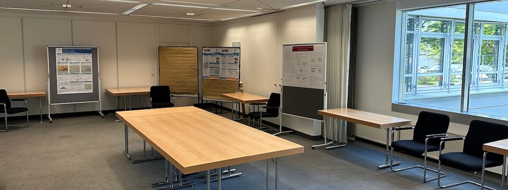

  Registration is now open: <a href="https://sumo2026.welcome-manager.de/">https://sumo2026.welcome-manager.de/</a>
   
  <small><b>Please keep in mind that the registration will close on May 15, 2026 (at 23:59 CEST).</b></small>

# Save the Date!

June 01-04, 2026, in Berlin.

The SUMO Conference, held every year in Berlin since 2013, is a must-attend event for anyone involved with SUMO. It gathers international participants from the industry, research and public institutions - to present (among others) projects, studies and advancements all around traffic, simulation and SUMO.

The conference offers opportunities to learn about new features, connect with other users, engage with the developers, exchange ideas, and even start new collaborations.

# Call for Papers

The conference focuses on presenting new and unique results in the field of mobility simulation and modelling using openly available tools and data. We expect a large variety of research topics and usage approaches.
Possible areas of interest include (but are not limited to):

- AI-based traffic modelling / AI-assisted simulation
- Data-driven calibration and validation
- Intermodal transport and shared mobility
- Simulation for traffic safety and risk assessment
- Real-time traffic prediction and control
- Large-scale simulation and high-performance computing
- Mobility and demand modelling
- Open tools and open data
- Traffic management solutions
- Sustainable urban traffic planning
- Autonomous driving
- Goods traffic and logistics simulation
- Digital twins in Intelligent transportation systems
- E-Mobility
- Vehicular communication

# Submissions

This year, there are three types of submission:

---

**1. Scientific Papers**
   - All accepted scientific papers must be presented at the conference.
   - Papers will be reviewed by at least two reviewers.
   - All accepted papers will be published in the [SUMO Conference Proceedings (SCP)](https://www.tib-op.org/ojs/index.php/scp/index).
   - Papers should be 5-20 pages long.
   - ~~Recommended: Submit the title and a short abstract (up to 300 words) in advance to receive initial feedback. Do this by Sunday, January 11, 2026 - 23:59 UTC.~~

  Authors are required to use the <a href="../documents/2025-08-25_Word-template-TIB-Open-Publishing-Conference.docx">Word</a> or <a href="../documents/TIBOpenPublishing_LaTeX-template.zip">LaTeX</a> template provided by TIB Open Publishing. 
  <b>Submissions that do not adhere to the specified template will not be considered.</b>

   - **The paper must be submitted in LaTeX or Word before Sunday, ~~February 22, 2026~~ March 01, 2026 - 23:59 UTC.**

<!-- 

 -->

---

 

**2. Posters**
  - The SUMO conference offers the opportunity to present your work during the poster session.
  - A scientific paper is not required.
  - Posters may present:
    - Bachelor's or Master's thesis results
    - Live Demos
    - SUMO use cases
    - Project presentations
    - Work in progress that would benefit from community feedback
  - Posters must be formatted in A0 size (841 x 1189 mm / 33.1 x 46.8 in). No specific template is required.
  - We will print your poster and provide a display panel, chair, and table.
  - Changes are allowed after the submission deadline, but we cannot reprint revised posters; you will need to bring the updated version yourself.
  - You may bring a laptop or device for demos or supplementary material (please bring your own equipment).
  - **Submit the title and a short abstract (up to 300 words) by Sunday, ~~February 22, 2026~~ March 01, 2026 - 23:59 UTC.**

<!-- 

 -->

---

 

**3. SUMO Moments**

To celebrate 25 years of SUMO, we invite the community to share *"SUMO Moments"* - short reflections, anecdotes, or milestones from your work with the software and the people around it. These stories can highlight technical breakthroughs, memorable challenges, or personal experiences that shaped your connection to SUMO.

- You are welcome to share:
  - Your first encounter with the SUMO community - for example your first ticket, bug report, or mailing list message
  - A key moment in a research project or application where SUMO played an important role
  - A surprising result, a lesson learned, or a simulation mishap that taught you something
  - Encounters with users, developers, or collaborators who influenced your work
  - Any memory that shows what SUMO has meant to you, your project, or your career
- Contributors will be able to register under the *Authors & Project Partners* special rate.
- **Submit a description (up to 300 words) until Sunday, ~~February 22, 2026~~ March 01, 2026 - 23:59 UTC.**

Selected submissions will be featured as brief presentations during the conference as part of the 25-year anniversary program. The goal is to capture the human side of the SUMO journey - the challenges, discoveries, and community interactions that have shaped the project over the past decades.

---

## Submission links

- Paper submissions: https://www.tib-op.org/ojs/index.php/scp/about/submissions 
<small>Login or register and then click on <b>"Make a new Conference Proceedings Submission"</b>.</small>
 
- Poster submissions: Send us an E-Mail with the subject **`Poster Submission - SUMO 2026`** to sumo-conference@dlr.de. Include the title and abstract in the body of the E-Mail.
- SUMO moments: Send us an E-Mail with the subject **`SUMO Moment - SUMO 2026`** to sumo-conference@dlr.de. Include the description in the body of the E-Mail.

## Ethics and Malpractice Statement

You can read our *[Publication Ethics and Publication Malpractice Statement](../documents/SUMOPublicationEthics.pdf)*, where we list the responsibilities of editors, reviewers, and authors.

# Important Dates

For papers:
- ~~Recommended title and abstract submission deadline: **Sunday, January 11, 2026.**~~
- New Paper submission deadline: ~~**Sunday, February 22, 2026.**~~ **Sunday, March 01, 2026.**
- Notification of acceptance/rejection: **First week of April 2026.**
- Camera-ready paper deadline: **Sunday, May 10, 2026.**

For posters:
- New Mandatory title and abstract submission deadline: ~~**Sunday, February 22, 2026.**~~ **Sunday, March 01, 2026.**
- New Notification of acceptance/rejection: ~~**Thursday, February 26, 2026.**~~ **Thursday, March 04, 2026.**
- Final poster upload deadline: **Sunday, May 03, 2026.**

For SUMO moments:
- New Description submission deadline: ~~**Sunday, February 22, 2026.**~~ **Sunday, March 01, 2026.**
- New Notification of acceptance/rejection: ~~**Thursday, February 26, 2026.**~~ **Thursday, March 04, 2026.**

# Prices

- Regular Ticket: **575 EUR**
- One-Day Ticket: **350 EUR**
- Authors and Project Partners: **375 EUR**
- Students & Invited Guests: **125 EUR** (limited) *

<small>All prices excluding VAT.</small>

*Please contact us via email at [sumo-conference@dlr.de](mailto:sumo-conference@dlr.de) to request a discount code for student registration.
The availability is limited.

# Registration

Registration is now open: <a href="https://sumo2026.welcome-manager.de/">https://sumo2026.welcome-manager.de/</a>
 
<small><b>Please keep in mind that the registration will close on May 15, 2026 (at 23:59 CEST).</b></small>

  <b>Authors:</b> Paper, poster and moments authors are required to register selecting the “Author & Project Partners” category.

<!-- The registration fee includes a two and a half day conference program with refreshments, lunch, proceedings and a social event in the evening. -->
Accommodation is not included within the registration fee and must be pre-booked separately.

  <b>Non-EU nationals:</b> Please register well in advance to facilitate internal procedures and (if necessary) ensure a smooth visa application process.

<!-- # FAQ

  
Hello

  World

  
Foo

  Bar

 -->

# Social Event

**⛴️ Boat Tour ⛴️**

<small>*Limited capacity</small>

*More info soon!*

# Language

The conference language is English.

# Venue

**WISTA Event Center - "Bunsen-Saal"** <small><a target="_blank" href="https://conventions.wista.de/en/rooms-locations#c5292">Website <i class="fa-solid fa-square-arrow-up-right"></i></a></small>   
Volmerstraße 2   
12489 Berlin   
Germany

<small style="color: lightgray">Images: © WISTA Management GmbH</small>
  

    

      

        
      

    

    

      

        
      

    

    

      

        
      

    

  

<iframe width="100%" height="350" src="https://www.openstreetmap.org/export/embed.html?bbox=13.533085584640505%2C52.42993042332849%2C13.536626100540163%2C52.43153965365014&amp;layer=mapnik&amp;marker=52.43073504583373%2C13.534855842590332" style="border: 1px solid black"></iframe>

<small>View in: <a target="_blank" href="https://www.openstreetmap.org/?mlat=52.430735&amp;mlon=13.534856#map=19/52.430735/13.534856">OSM <i class="fa-solid fa-square-arrow-up-right"></i></a> - <a target="_blank" href="https://maps.app.goo.gl/iD5ahnSaGRGvpTcP7">Google Maps <i class="fa-solid fa-square-arrow-up-right"></i></a> - <a target="_blank" href="https://maps.apple/p/S~s11mzEKLQ1Am">Apple Maps <i class="fa-solid fa-square-arrow-up-right"></i></a></small>

# Contact

For questions or comments, please contact the conference team at [sumo-conference@dlr.de](mailto:sumo-conference@dlr.de).