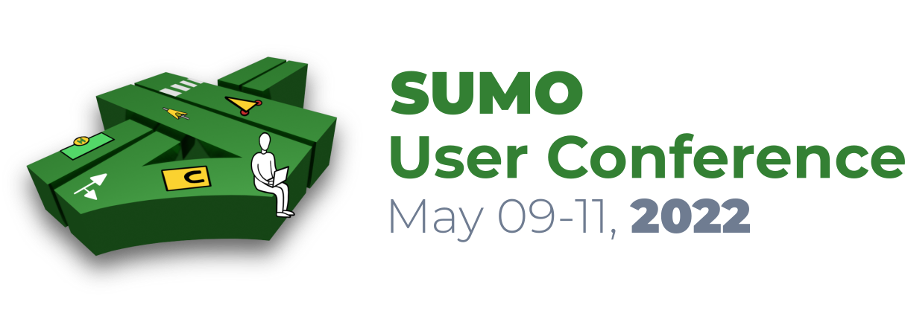

<!-- 

  Registration is now open.

 -->

<!-- # Call for Papers
The conference focuses on presenting new and unique results in the field of mobility simulation and modelling using openly available tools and data. We expect a large variety of research topics and usage approaches. If you are working on a research project fitting the topics below, you are kindly invited to submit an abstract. Possible areas of interest include (but are not limited to):

- Mobility and Demand Modelling
- Traffic Simulation
- Open Tools and Open Data
- Modelling Urban Mobility
- Traffic Applications
- Traffic Management Solutions
- Intermodal Transport
- Autonomous Driving
- Logistics Simulation
- Vehicular Communication
- E-Mobility
- Reinforcement learning / Machine Learning

# Paper Submission
***Attention***: We changed our paper submission process. We are now offering two submission types:

1. Scientific Papers:
   - All accepted scientific papers must be presented at the conference.
   - Scientific papers will be reviewed by at least 2 reviewers.
   - All accepted scientific papers will be published in the SUMO proceedings.
   - Scientific papers must be submitted in LaTeX or Word format before midnight, Monday, ~~*February 14th, 2022*~~ **February 28th, 2022**.
   - Scientific papers should be between 5 and 20 pages long.   
  
2. Technical Presentations:

    - The SUMO conference gives the opportunity to present your topic during the poster session or an oral short presentation.
    - There is no need to write a scientific paper.
    - Possible technical presentations can be:
        - Results of Bachelor or Master theses
        - Live Demos
        - SUMO Use Cases
        - Project Presentations
        - Work in Progress which would benefit from the feedback of other SUMO users
    - Title and a short abstract (300 words) must be submitted until Monday, ~~*February 14th, 2022*~~ **February 28th, 2022**.

**Templates and instructions for authors** can be found here: https://easychair.org/publications/for_authors   
Technical Presentations do not require following a template, feel free to use your own style! -->

# Important Dates (for Authors)

- Paper and Abstract Submission Deadline: **Monday,** ~~*February 14th, 2022*~~ **February 28th, 2022**. &#x2714;
- Notification of Acceptance: **End of March, 2022**. &#x2714;
- Camera Ready version due: **Monday, April 25th, 2022**.

  Please upload the camera ready version paper as an update to the submission in EasyChair.

# Zoom
The entire conference will take place on the same Zoom Meeting. Click on the Meeting-ID below to join.

**Meeting-ID:** [891 0998 5557](https://zoom.us/j/89109985557)   
**Passcode:** *See your Zoom Confirmation Email (received after [registration](#registration))*

# Agenda

<small>&#128339; <i>Schedule given in Central European Summer Time (CEST) (UTC+2) - This agenda may be subject to change</i></small>

<table style="border: 2px solid #999;">
<thead>
  <tr>
    <th style="text-align:center" colspan="2">Monday, May 09, 2022</th>
  </tr>
</thead>
<tbody>
  <tr>
    <td align="right">13:00 - 14:00</td>
    <td>
    <b>Opening & Tutorial</b> 
    </td>
  </tr>
  <tr>
    <td align="right">14:30 - 15:30</td>
    <td>
    <b>Ask us anything</b> 
    </td>
  </tr>
  <tr>
    <td align="right">16:00 - 17:00</td>
    <td>
   <b>TAPAS Workshop</b> 
   Matthias Heinrichs / Daniel Krajzewicz

<a style="color:#0645ad; cursor:pointer;" href="#tapas-workshop">Read more <i class="fas fa-angle-down"></i></a>

    </td>
  </tr>
</tbody>
</table>

 

<table style="border: 2px solid #999;">
<thead>
  <tr>
    <th style="text-align:center" colspan="2">Tuesday, May 10, 2022</th>
  </tr>
</thead>
<tbody>
  <tr>
    <td align="right">09:00 - 10:20  Session 1 <b>Traffic lights</b></td>
<td>
    <b>&#128193; Extension and Validation of NEMA-Style Dual-Ring Controller in SUMO</b> 
    Max Schrader, Qichao Wang and Joshua Bittle

    <b>&#128193; A Comparison of Reinforcement Learning Agents Applied to Traffic Signal Optimisation</b> 
    Cobus Louw, Louwrens Labuschange and Tiffany Woodley

    <b>&#128193; High fidelity modelling of traffic light control with xml logic representation</b> 
    Maik Halbach and Jakob Erdmann

    <b>Evaluating traffic performance of transit signal priority using SUMO simulation: A real-world case</b> 
    Chun-Cheng Liang, Hsuan-Chih Wang, Wei-Hsun Lee and Ming-Te Wang
    </td>
  </tr>
  <tr>
    <td align="right">10:40 - 12:00  Session 2 <b>Other modes of transportation</b></td>
<td>
    <b>Simulating Digital Rail: From PlanPro railway plannings to SUMO simulations</b> 
    Arne Boockmeyer, Robert Schmid and Andreas Polze

    <b>&#128193; A dynamic model for ride-matching problem in multi-hop ride-sharing system</b> 
    Linyang Wang and Jianping Wu

    <b>&#128193; Investigating the behaviors of cyclists and pedestrians under automated shuttle operation</b> 
    Yun-Pang Flötteröd, Iman Pereira, Johan Olstam and Laura Bieker-Walz

    <b>Simulating Personal Rapid Transit in SUMO</b> 
    Felix Gotzler and Franziska Neumann
    </td>
  </tr>
  <tr>
    <td style="text-align:center; background-color: #d9f1ff;" colspan="2"><b><i>Lunch break </b></i>&#x2615;</td>
  </tr>
  <tr>
    <td align="right">13:00 - 14:00</td>
    <td>
    <b>Keynote:
    Simulating and modelling traffic: What are we trying to achieve?</b> 
    Prof. Dr.-Ing. Heather Kaths
    
<a style="color:#0645ad; cursor:pointer;" href="#keynote">Read more <i class="fas fa-angle-down"></i></a>

    </td>
  </tr>
  <tr>
    <td align="right">14:30 - 15:30  Session 3 <b>Autonomous Vehicles</b></td>
<td>
    <b>&#128193; SUMO4AV: An Environment to Simulate Scenarios for Shared Autonomous Vehicle Fleets with SUMO Based on OpenStreetMap Data</b> 
    Emanuel Reichsöllner, Andreas Freymann, Mirko Sonntag and Ingo Trautwein

    <b>&#128193; Extending SUMO for Lane-Free Microscopic Simulation of Connected and Automated Vehicles</b> 
    Dimitrios Troullinos, Georgios Chalkiadakis, Diamantis Manolis, Ioannis Papamichail and Markos Papageorgiou

    <b>&#128193; Simulating platooned connected autonomous vehicle in a large scale urban scenario</b> 
    Joerg Schweizer, Cristian Poliziani and Federico Rupi
    </td>
  </tr>
  <tr>
    <td align="right">16:00 - 17:00  Session 4 <b>ITS</b></td>
<td>
    <b>Utilizing Vehicle Trajectory Data (Probe Data) from Connected Vehicles (CV) to Characterize Performance Measures of a Highway Corridor with Incidents</b> 
    Norris Novat, Emmanuel Kidando and Jacqueline Jenkins

    <b>&#128193; Multi-Modal Traffic Simulation Calibration and Integration with Real-Time Hardware in Loop Simulator</b> 
    Vikhyat Kalra, Punit Tulpule and Jacob Isaman

    <b>Simulation of surrounding traffic in a driving simulator – Coupling Sumo, RoadRunner and Unity</b> 
    Richard Schulte Holthausen, Moritz Berghaus and Philipp-Armand Klee
    </td>
  </tr>
  <tr style="background-color: #d0f0c0;">
    <td align="right">17:00</td>
    <td><b><i>Social Event</i></b> &#x1F3B2;
        
<a style="color:#0645ad; cursor:pointer;" href="#social-event">Read more <i class="fas fa-angle-down"></i></a>
</td>
  </tr>
</tbody>
</table>

 

<table style="border: 2px solid #999;">
<thead>
  <tr>
    <th style="text-align:center" colspan="2">Wednesday, May 11, 2022</th>
  </tr>
</thead>
<tbody>
  <tr>
    <td align="right">09:00 - 10:20  Session 5 <b>Routing / Efficiency / Logistics</b></td>
<td>
    <b>&#128193; Proposing a Simulation-Based Dynamic System Optimal Traffic Assignment Algorithm for SUMO: An Approximation of Marginal Travel Time</b> 
    Behzad Bamdad Mehrabani, Jakob Erdmann, Luca Sgambi and Maaike Snelder

    <b>&#128193; Combining operative train simulation with logistics simulation in SUMO</b> 
    Jakob Geischberger and Norman Weik

    <b>A Virtual Testbed for the Development of AI Solutions to Boost Operational Efficiency in Road Transportation Networks</b> 
    Arun Sathanur, Arif Khan, Milan Jain and Ashutosh Dutta

    <b>i4Port: Simulation of drayage operations based on vehicle communication technologies at port terminals</b> 
    Victor Madrigal
    </td>
  </tr>
  <tr>
    <td align="right">10:40 - 12:00  Session 6 <b>Micro simulation / other</b></td>
<td>
    <b>&#128193; Signal priority for improving fluidity and decreasing fuel consumption</b> 
    Jacques Renaud, Leandro Coelho, Khaled Belhassine and Vincent Turgeon

    <b>Statistics and Visualizations of SUMO Scenario Runs</b> 
    Mark Cowan

    <b>Combining microtraffic models and complex vehicular simulators</b> 
    Aron Jazcilevich, Adolfo Hernández-Moreno, Ulises Diego-Ayala and Ivan Hernández-Paniagua
    </td>
  </tr>
  <tr>
    <td style="text-align:center; background-color: #d9f1ff;" colspan="2"><b><i>Lunch break </b></i>&#x2615;</td>
  </tr>
  <tr>
    <td align="right">13:00 - 14:00  Session 7 <b>Tools / other</b></td>
<td>
    <b>Simulation of Urban Air Mobility: Progress from the HorizonUAM Project</b> 
    Nabih Naeem, Patrick Ratei, Nazlican Cigal, Prajwal Shiva Prakasha, Thomas Zill and Björn Nagel

    <b>&#128193; Topology-Preserving Simplification of OpenStreetMap Network Data for Large-scale Simulation in SUMO</b> 
    Zhuoxiao Meng, Xiaorui Du, Paolo Sottovia, Daniele Foroni, Cristian Axenie, Alexander Wieder, David Eckhoff, Stefano Bortoli, Alois Knoll and Christoph Sommer

    <b>SUMO for parking studies: Challenges and opportunities</b> 
    Prashant Chauhan, Salil Goel and Stephan Winter
    </td>
  </tr>
  <tr>
    <td align="right">14:30 - 15:30  Session 8 <b>Tools / Co-simulation</b></td>
<td>
    <b>strazoon Planning Solutions - building generic traffic models for SUMO</b> 
    Martin Reuß and Tobias Lukowitz

    <b>&#128193; Implementation of a Perception Module for Smart Mobility Applications in Eclipse MOSAIC</b> 
    Robert Protzmann, Karl Schrab, Moritz Schweppenhäuser and Ilja Radusch

    <b>A Co-Simulation Middleware: Virtual Testing of Automotive Applications with Multiple Simulators</b> 
    Dominik Salles, Lukas Lang, Martin Kehrer and Hans-Christian Reuss
    </td>
  </tr>
  <tr>
    <td align="right">16:00 - 17:00  Session 9 <b>Scenarios</b></td>
<td>
    <b>Evaluating measures for prioritising urban public transport using SUMO – A case study of a corridor in Münster, Germany</b> 
    Marcus Herbrecht, Moritz Berghaus and Philipp-Armand Klee

    <b>Simulation of traffic scenarios using SUMO</b> 
    Siva Jagadesh M., Vignesh Bondugula, Vijay Jaisankar, Jayati Deshmukh and Srinath Srinivasa

    <b>&#128193; Building a real-world traffic micro-simulation scenario from scratch with SUMO</b> 
    Maria Laura Clemente
    </td>
  </tr>
  <tr>
    <td align="right">17:00</td>
    <td><b><i>Closing Session +  voting for best presentation</i></b></td>
  </tr>
</tbody>
</table>
<small>&#128193; = Scientific Paper</small>

# Keynote

<h3><i>Simulating and modelling traffic: What are we trying to achieve?</i></h3>

 <small style="color: lightgray">© Friederike von Heyden/Bergische Universität Wuppertal</small>
<h6>Prof. Dr.-Ing. Heather Kaths</h6>
Head of the Department for Bicycle Traffic Planning 
University of Wuppertal 
<a href="https://radverkehr.uni-wuppertal.de/en/home/associates/prof-dr-ing-heather-kaths.html" class="btn btn-sm btn-outline-info" style="margin-top:10px;">Website</a>

Our ability to virtually recreate infrastructure and traffic flow at many different scales, from the very detailed simulation of systems used to drive and control vehicles to the depiction of congestion in country-wide highway networks, has improved drastically over the last decades. The data needed to develop, calibrate and validate simulation models is increasingly at our fingertips. An active and growing community of academics and industry personnel dedicate time and expert knowledge to improving and optimizing traffic simulation tools and workflows. At the same time, issues such as air pollution, traffic injuries and fatalities, noise and disconnected urban space persist. In this keynote, I want to explore how tools for creating virtual, simulated worlds are helping to solve actual problems in our real world: what is done today, and what opportunities are there for tomorrow?

# TAPAS Workshop
The agent-based  demand model TAPAS is an open source development of DLR’s Institute for Transport Research. TAPAS simulated the mobility patterns of a virtual population of a modelled regions. Both the population as well as the activity places are represented individually. TAPAS distinguishes a large set of person groups, and different modes of transport. The mobility behavior of the population is determined using empirical daily mobility plans. The result is a list of daily activities for each person within the modeled area, including the starting location, the destination location, the begin of the ride and the ride’s duration as well as the chosen mode, among others. The result can be used as an input for the microscopic traffic flow simulation SUMO.

Within the talk, the functioning of TAPAS will be presented as well as different application scenarios, ranging from public transport pricing, installation of demand-responsive transport to air quality measures on city scale.

<a href="https://www.dlr.de/vf/en/desktopdefault.aspx/tabid-12751/22270_read-29381/" class="btn btn-sm btn-outline-info" style="margin-top:10px;">About TAPAS</a>
<a href="https://github.com/DLR-VF/TAPAS" class="btn btn-sm btn-outline-info" style="margin-top:10px;">GitHub repository</a>

# Social Event
We are going to have a fun SUMO-related quiz using [Menti](https://www.menti.com/). Join our [Zoom meeting](#zoom) and have a smartphone/tablet ready at hand. Test your knowledge of SUMO and win the glorious and prestigious prize of attaching your name to an easter egg in “sumo-gui”:

(Check out the current SUMO guru, by pressing `Shift` + `F11` in sumo-gui 1.8.0 or newer)

# Registration
Please register [here](https://us06web.zoom.us/meeting/register/tZ0sd-Chpj4vH9PmVD8w-2uLqMy8n2Ssv1x_).

# Prices
Participation at this year's conference will be **free of charge**!

# Language
The conference language is English.

# Venue
Given the extraordinary situation we are facing, this year's SUMO User Conference will be again **online** - via [Zoom](#zoom).

# Contact
Please contact the conference team via mail at [sumo-conference@dlr.de](mailto:sumo-conference@dlr.de)

---

