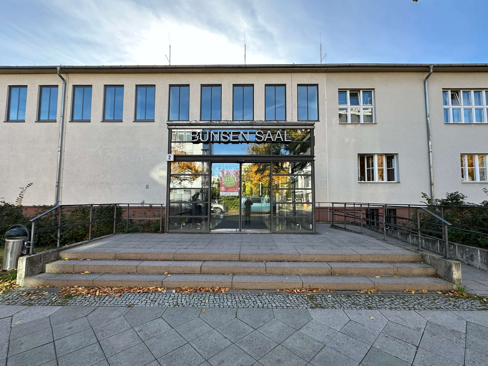

# Save the Date!

June 01-04, 2026, in Berlin.

<!-- The SUMO User Conference, held every year in Berlin since 2013, is a must-attend event for anyone involved with SUMO. It gathers international participants from the industry, research and public institutions - to present (among others) projects, studies and advancements all around traffic, simulation and SUMO.

The conference is a great place to learn about new features, network with fellow enthusiasts, ask the developers, have fruitful discussions, exchange ideas and even start collaborations! -->

<!-- # FAQ

  
Hello

  World

  
Foo

  Bar

 -->

<!-- # Social Event

*More info soon!*

# Language

The conference language is English. -->

# Venue

    

        

<b>Bunsen-Saal</b> 
Volmerstraße 2 
12489 Berlin 
Germany
        

        

            
        

    

<iframe width="100%" height="350" src="https://www.openstreetmap.org/export/embed.html?bbox=13.533085584640505%2C52.42993042332849%2C13.536626100540163%2C52.43153965365014&amp;layer=mapnik&amp;marker=52.43073504583373%2C13.534855842590332" style="border: 1px solid black"></iframe>

<small>View in: <a target="_blank" href="https://www.openstreetmap.org/?mlat=52.430735&amp;mlon=13.534856#map=19/52.430735/13.534856">OSM <i class="fa-solid fa-square-arrow-up-right"></i></a> - <a target="_blank" href="https://maps.app.goo.gl/iD5ahnSaGRGvpTcP7">Google Maps <i class="fa-solid fa-square-arrow-up-right"></i></a> - <a target="_blank" href="https://maps.apple/p/S~s11mzEKLQ1Am">Apple Maps <i class="fa-solid fa-square-arrow-up-right"></i></a></small>

# Contact

For questions and comments, the conference team can be reached at the email address [sumo-conference@dlr.de](mailto:sumo-conference@dlr.de).