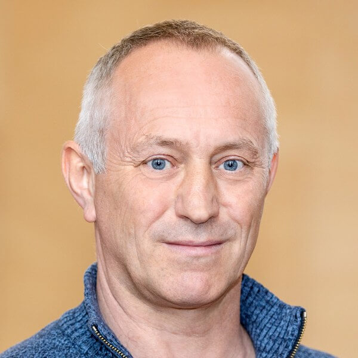

<!--
The SUMO User Conference, held every year in Berlin since 2013, is a must-attend event for anyone involved with SUMO. It gathers international participants from the industry, research and public institutions - to present (among others) projects, studies and advancements all around traffic, simulation and SUMO.

The conference is a great place to learn about new features, network with fellow enthusiasts, ask the developers, have fruitful discussions, exchange ideas and even start collaborations!
-->

<!--
# Call for Papers

The conference focuses on presenting new and unique results in the field of mobility simulation and modelling using openly available tools and data. We expect a large variety of research topics and usage approaches.
If you are working on a research project fitting the topics below, you are kindly invited to submit a scientific paper or an abstract for a poster. Possible areas of interest include (but are not limited to):

- Mobility and Demand Modelling
- Traffic Simulation
- Open Tools and Open Data
- Modelling Urban Mobility
- Traffic Applications
- Traffic Management Solutions
- Intermodal Transport
- Autonomous Driving
- Logistics Simulation
- Vehicular Communication
- E-Mobility
- Reinforcement learning / Machine Learning

# Paper Submission

There are two submission types:

---

1. Scientific Papers:
   - All accepted scientific papers must be presented at the conference.
   - Scientific papers will be reviewed by at least 2 reviewers.
   - All accepted scientific papers will be published in the [SUMO proceedings](https://www.tib-op.org/ojs/index.php/scp/index).
   - Scientific papers should be between 5 and 20 pages long.
   - **The Paper must be submitted in LaTeX or Word format before Sunday,** ~~February 16, 2025~~ New **February 23, 2025 at 11:59 PM (Berlin time)**.

  Authors are required to use the <a href="https://www.tib-op.org/ojs/index.php/scp/libraryFiles/downloadPublic/8">Word</a> or <a href="https://www.tib-op.org/ojs/index.php/scp/libraryFiles/downloadPublic/9">LaTeX</a> template provided by TIB Open Publishing. 
  <b>Submissions that do not adhere to the specified template will not be considered.</b>

---

 

2. Posters:
    - The SUMO conference gives the opportunity to present your topic during the poster session.
    - There is no need to write a scientific paper.
    - Possible contents can be:
        - Results of Bachelor or Master theses
        - Live Demos
        - SUMO Use Cases
        - Project Presentations
        - Work in Progress which would benefit from the feedback of other SUMO users
    - The Posters do not require following a specific template, but should be formatted in the A0 size (841 x 1189 mm / 33.1 x 46.8 in).
    - We will print the poster for you, provide the display panel, a chair and a table.
    - While changes to the poster are still possible after the submission deadline, we unfortunately will not be able to reprint it. If you do need to make changes, you would need to bring a printout of the updated version with you.
    - You are welcome to bring a laptop or other device to show a demo, slides, videos or any material that you deem appropriate to complement the presentation. In this case you will need to provide your own equipment.
    - **Title and a short abstract (up to 300 words) must be submitted until Sunday, February 23, 2025, at 11:59 PM (Berlin time)**.

---

## Submission Link

- Link for Paper submissions: https://www.tib-op.org/ojs/index.php/scp/about/submissions 
<small>Login or register and then click on <b>"Make a new Conference Proceedings Submission"</b></small>
 
- Poster submissions: Send us an E-Mail with the subject **`Poster Submission - SUMO 2025`** to sumo-conference@dlr.de. Include the title and abstract in the body of the E-Mail. -->
<!--
## Ethics and Malpractice Statement

You can read our *[Publication Ethics and Publication Malpractice Statement](../documents/SUMOPublicationEthics.pdf)*, where we list the responsibilities of editors, reviewers, and authors.
-->

# Agenda

<small>&#128339; <i>Schedule given in Central European Summer Time (CEST) (UTC+2) - This agenda may be subject to change</i></small>

<table style="border: 2px solid #bbb;">
<thead>
  <tr>
    <th style="text-align:center" colspan="3">Monday, May 12, 2025</th>
  </tr>
</thead>
<tbody>
  <tr>
    <td align="right">12:30 - 13:00</td>
    <td colspan="2">
    Registration 
    </td>
  </tr>
  <tr>
    <td align="right">13:00 - 13:15</td>
    <td colspan="2">
    Opening 
    </td>
  </tr>
  <tr>
    <td align="right">13:15 - 14:15</td>
    <td><b>SUMO Tutorial</b></td>
    <td rowspan="2">
    
<i class="fa-solid fa-video fa-xl"></i> 
    
    Will be transmitted via Zoom. 
    <a href="https://us06web.zoom.us/meeting/register/19YPHYViTFiOw64Qn3-uJg">Register here</a> for free, to get the link.
    

    </td>
  </tr>
  <tr>
    <td align="right">14:15 - 15:15</td>
    <td><b>Ask us anything</b></td>
  </tr>
  <tr>
    <td align="right">15:15 - 15:45</td>
    <td colspan="2">
    <i>Coffee Break</i> &#x2615; 
    </td>
  </tr>
  <tr>
    <td align="right">15:45 - 17:00</td>
    <td>
    <b>Modeling Advanced Mobility with Eclipse MOSAIC</b> 
    Karl Schrab and Georg Hoelger <i><small>(all: Fraunhofer FOKUS)</small></i>
    </td>
    <td>MoDa Workshop</td>
  </tr>
  <tr>
    <td align="right">17:30 - 18:30</td>
    <td colspan="2">
   <b>Evening Program - Social Event</b> 
   Guided tour through the Adlershof Science and Technology Park campus. 
<a style="color:#0645ad; cursor:pointer;" href="#social-event">Read more <i class="fas fa-angle-down"></i></a>
    </td>
  </tr>
      <tr>
    <td align="right">18:30</td>
    <td colspan="2">
    Dinner (self-paid) 
    </td>
  </tr>
</tbody>
</table>

 

<table style="border: 2px solid #bbb;">
<thead>
  <tr>
    <th style="text-align:center" colspan="3">Tuesday, May 13, 2025</th>
  </tr>
</thead>
<tbody>
      <tr>
    <td align="right">09:00 - 09:15</td>
    <td colspan="2">
    <b>Opening Address</b>
     Robert Hilbrich <i><small>SUMO Team Lead</small></i>
    </td>
  </tr>
  <tr>
    <td align="right">09:15 - 10:15  Session 1 <b>&nbsp;</b>
Session chair: Benjamin Couéraud
</td>
<td colspan="2">
<a target="_blank" href="https://sumo.dlr.de/pdf/2025/pre-print-2590.pdf"><i class="fa-solid fa-file"></i> Preprint</a>
    <b>Overcoming Data Scarcity in Calibrating SUMO Scenarios with Evolutionary Algorithms</b> 
    Jakob Kappenberger and Heiner Stuckenschmidt <i><small>(all: Uni Mannheim)</small></i>

<a target="_blank" href="https://sumo.dlr.de/pdf/2025/pre-print-2628.pdf"><i class="fa-solid fa-file"></i> Preprint</a>
    <b>Spatio-Temporal AI Modeling for Urban Traffic Calibration: A SUMO-Based Approach</b> 
    Pablo Manglano-Redondo, Alvaro Paricio-Garcia and Miguel A. Lopez-Carmona <i><small>(all: Universidad de Alcalá)</small></i>
</td>
  </tr>
    <tr>
    <td align="right">10:15 - 10:45</td>
    <td colspan="2">
    <i>Coffee Break</i> &#x2615; 
    </td>
  </tr>
  <tr>
    <td align="right">10:45 - 12:15  Session 2 <b>&nbsp;</b>
Session chair: Michael Behrisch
</td>
<td colspan="2">
<a target="_blank" href="https://sumo.dlr.de/pdf/2025/pre-print-2619.pdf"><i class="fa-solid fa-file"></i> Preprint</a>
    <b>Digital Twin-Aided Municipal Traffic Control</b> 
    Sercan Aygun <i><small>(University of Louisiana at Lafayette)</small></i>, Reeti Pradhananga <i><small>(University of Louisiana at Lafayette)</small></i>, Shelby Williams <i><small>(University of Louisiana at Lafayette)</small></i>, Li Chen <i><small>(University of Louisiana at Lafayette)</small></i>, Yazhou Tu <i><small>(Auburn University)</small></i>, Whitney Crow <i><small>(Mississippi State University)</small></i>, Sathyanarayanan Aakur <i><small>(Auburn University)</small></i> and Nian-Feng Tzeng <i><small>(University of Louisiana at Lafayette)</small></i>

<a target="_blank" href="https://sumo.dlr.de/pdf/2025/pre-print-2633.pdf"><i class="fa-solid fa-file"></i> Preprint</a>
    <b>SUMO Simulation of DLR's Research Intersection</b> 
    Yun-Pang Flötteröd and Peter Wagner <i><small>(all: DLR)</small></i>

<a target="_blank" href="https://sumo.dlr.de/pdf/2025/pre-print-2605.pdf"><i class="fa-solid fa-file"></i> Preprint</a>
    <b>HaTS - Hanover Traffic Scenario for SUMO</b> 
    Nico Ostendorf <i><small>(Robert Bosch GmbH)</small></i>, Keno Garlichs <i><small>(Robert Bosch GmbH)</small></i> and Lars C. Wolf <i><small>(TU Braunschweig)</small></i>
</td>
  </tr>
  <tr>
    <td style="text-align:center; background-color: #d9f1ff;" colspan="3"><b><i>Lunch </b></i>&#x1F957;</td>
  </tr>
  <tr>
    <td align="right">13:00 - 13:30</td>
    <td colspan="2">
    <b>Transportation Systems Research @ DLR</b> 
    Sascha Knake-Langhorst <i><small>(DLR)</small></i>
    </td>
  </tr>
  <tr>
    <td align="right">13:30 - 14:30</td>
    <td colspan="2">
    <b>Keynote:
    Movement and waiting of crowds – state of the art models and data</b> 
    Prof. Dr. Armin Seyfried <i><small>(Forschungszentrum Jülich GmbH)</small></i>
     
    <a style="color:#0645ad; cursor:pointer;" href="#keynote">Read more <i class="fas fa-angle-down"></i></a>
    </td>
  </tr>
  <tr>
    <td align="right">14:30 - 15:00</td>
    <td colspan="2">
    &#x1F4F7; <i>Conference Photo + Coffee Break</i> &#x2615; 
    </td>
  </tr>
    <tr>
    <td align="right">15:00 - 16:00  Session 3 <b>&nbsp;</b>
Session chair: Yun-Pang Flötteröd
</td>
<td colspan="2">
<a target="_blank" href="https://sumo.dlr.de/pdf/2025/pre-print-2613.pdf"><i class="fa-solid fa-file"></i> Preprint</a>
    <b>Modeling Bus Traffic for the Berlin SUMO Traffic Scenario</b> 
    Moritz Schweppenhäuser <i><small>(Fraunhofer FOKUS)</small></i>, Timo Großmann <i><small>(TU Berlin)</small></i>, Karl Schrab <i><small>(Fraunhofer FOKUS)</small></i>, Robert Protzmann <i><small>(Fraunhofer FOKUS)</small></i> and Ilja Radusch <i><small>(Daimler Center for Automotive IT Innovations)</small></i>

<a target="_blank" href="https://sumo.dlr.de/pdf/2025/pre-print-2618.pdf"><i class="fa-solid fa-file"></i> Preprint</a>
    <b>Modeling Passenger Boarding Times using Sumonity’s Sub-microscopic Pedestrian Simulation</b> 
    Johannes Lindner, Mathias Pechinger and Klaus Bogenberger <i><small>(all: Technical University of Munich)</small></i>
</td>
  </tr>
  <tr>
    <td align="right">16:00 - 17:00  Session 4 <b>Poster Session</b>  </td>
<td>
<ul>
<li>A digital twin for passenger-centred intermodal disturbance management in public transport - <small>Lukas Hösch</small></li>
<li>Leveraging SUMO for Traffic Twins: Experiences in Urban Traffic Processing - <small>Alejandro Morales-Hernández, Eladio Montero-Porras, Davide Andrea Guastella, Gianluca Bontempi and Bruno Cornelis</small></li>
<li>SumoWare: Bridging Sumo and Autoware for Realistic Autonomous Vehicle Evaluation - <small>Evald Nexhipi, Faruk Öztürk, Mathias Pechinger and Klaus Bogenberger </small></li>
<li>FoundationTSC - Towards Adaptive Traffic Control through Foundation Models and Reinforcement Learning - <small>Lukas Klein, Arthur Müller and Magnus Redeker</small></li>
<li>Simulation Framework for Evaluating Autonomous Delivery Robots in Urban Environments - <small>Philipp Münst, Jan-Philip Rehbein and Rick Voßwinkel</small></li>

<li>Cycling on Hills: Approaches for Adjusting Cycling Speed Based on Real-world Data - <small>Danil Belikhov and Heather Kaths</small></li>
<li>Evaluating the operational and economic feasibility of mobile charging pods for electric bus operations - <small>Mohd Aiman Khan, Wilco Burghout, Oded Cats, Erik Jenelius and Matej Cebecauer</small></li>
</ul>
  </td>
  <td><b>JuPedSim</b>
   
  Coupled Simulation of Traffic Flow and Pedestrian Dynamics for Enhanced Urban Mobility Planning - <small>Jette Schumann and Ronald Nippold</small>
  </td>
  <tr>
    <td align="right">17:15</td>
    <td colspan="2"><b>Evening Program - Barbecue</b> &#127830;
    </td>
  </tr>
</tbody>
</table>

 

<table style="border: 2px solid #bbb;">
<thead>
  <tr>
    <th style="text-align:center" colspan="2">Wednesday, May 14, 2025</th>
  </tr>
</thead>
<tbody>
  <tr>
    <td align="right">09:00 - 10:30  Session 5 <b>&nbsp;</b>
Session chair: Peter Wagner
</td>
<td>
<a target="_blank" href="https://sumo.dlr.de/pdf/2025/pre-print-2622.pdf"><i class="fa-solid fa-file"></i> Preprint</a>
    <b>Effects of charging strategies and policies on electric vehicles and infrastructure from a microscopic perspective</b> 
    Mirko Barthauer <i><small>(DLR)</small></i>

<a target="_blank" href="https://sumo.dlr.de/pdf/2025/pre-print-2617.pdf"><i class="fa-solid fa-file"></i> Preprint</a>
    <b>SUMO in SPACE: Combining SUMO and dSPACE for Advanced Traffic Simulation</b> 
    Christopher Stang <i><small>(ZF Friedrichshafen AG)</small></i> and Dennis Roeser <i><small>(dSPACE GmbH)</small></i>

<a target="_blank" href="https://sumo.dlr.de/pdf/2025/pre-print-2647.pdf"><i class="fa-solid fa-file"></i> Preprint</a>
    <b>Towards Improved Traffic Impact Assessments for Construction Sites</b> 
    Robert Hilbrich <i><small>(DLR - co4e GmbH)</small></i>, Jürgen Besler <i><small>(infrest)</small></i>, Natalie Dust <i><small>(infrest)</small>, Heiner Kretzer <i><small>(BWB)</small> and Bertram Monninkhoff <i><small>(BWB)</small></i>
</td>
  </tr>
      <tr>
    <td align="right">10:30 - 11:00</td>
    <td>
    <i>Coffee Break</i> &#x2615; 
    </td>
  </tr>
  <tr>
    <td align="right">11:00 - 12:00  Session 6 <b>Poster Session</b>  </td>
<td>
<ul>
<li>Green Light Optimal Speed Advisory with Reduced Default Speed – Analysis of Speed Distribution
and Emissions of Road Users - <small>Maik Halbach</small></li>
<li>RouteRL: MARL framework for urban route choice with autonomous vehicles - <small>Anastasia Psarou, Ahmet Onur Akman, Łukasz Gorczyca, Zoltán György Varga, Grzegorz Jamróz and Rafał Kucharski</small></li>
<li>Modelling realistic urban traffic scenarios for the city of Osnabrück based on traffic count data and calculating emissions using SUMO - <small>Rebecca Kose, Dominik Diedrich, Mathias Heiker and Sandra Rosenberger</small></li>
<li>Traffic micro-simulation to identify critical road safety cases in lateral interactions - <small>Angela Carboni, Matteo Ferraro, Francesco Deflorio and Lorenzo Sica</small></li>
<li>FTO-Sim: Floating Traffic Observation – An Open-Source Simulation Framework - <small>Mario Ilic, Mathias Pechinger, Tanja Niels and Klaus Bogenberger</small></li>
<li>rescuePY: Realtime-capable Digital Twins for Rescue Systems - A SUMO-Centered Approach - <small>Fabian Schuhmann</small></li>
<li>Microscopic Simulation of Mobility on Demand Services: Coupling Framework for FleetPy and SUMO - <small>Joel Brodersen and Florian Dandl</small></li>
<li>Urban Attractors for Swarms of Micromobility E-riders - <small>Juan Salamanca and Venkataramanan Srinivasan</small></li>
<li>Sensitivity of traffic emissions to traffic management and modelling - <small>Addina Shafiyya Ediansjah, Jens Borken-Kleefeld and Meng Wang</small></li>
</ul>
</td>
  </tr>
  <tr>
    <td style="text-align:center; background-color: #d9f1ff;" colspan="2"><b><i>Lunch </b></i>&#x1F957;</td>
  </tr>
  <tr>
    <td align="right">13:00 - 14:00  Session 7 <b>Poster Session</b>  </td>
<td>
<ul>
<li>Urban rail assessment in SUMO - <small>Paula von der Heide and Gregor Wehrle</small></li>
<li>Adapting vehicle driving behavior to extreme flood events – A case study in the city of Cologne, Germany - <small>Ana Maria Mager Pozo</small></li>
<li>Dynamic simulation of bus emissions in urban transport - <small>Sina-Marie Anker, Rebecca Kose and Sandra Rosenberger</small></li>
<li>Sumonity Updates 2025: Pedestrian Modeling, and Streamlined Deployment - <small>Mathias Pechinger, Johannes Lindner and Klaus Bogenberger</small></li>
<li>TrafficTwin : a Simulation Tool to Assess the Impact of Deviation Plans on Disruptive Events of Urban Traffic - <small>Davide Andrea Guastella, Moisés Silva-Muñoz, Eladio Montero-Porras and Gianluca Bontempi</small></li>
<li>Aix-Marseille Metropolitan Mobility Digital Twin Development based on Modeling and Simulation of Vehicular Traffic - <small>Thi Phuong Kieu, Hassan Haghighi and Maamar El Amine Hamri</small></li>
<li>Explicit Modeling of Tactical Driving Behavior: Conceptualizing a “Clean Architecture for Microscopic Traffic Flow Simulation” - <small>Marvin Baumann and Peter Vortisch</small></li>
<li>Charging Activities Simulation of Electric Cars in Urban Areas - <small>Matteo Ferraro, Lorenzo Sica and Francesco Deflorio</small></li>
<li>A Digital Twin of Signalized Intersections Integrating LISA and Real-time Traffic Detectors Data into SUMO - <small>Meng Wang and Runhao Zhou</small></li>
</ul>
    </td>
  </tr>
      <tr>
    <td align="right">14:00 - 14:30</td>
    <td>
    <i>Coffee Break</i> &#x2615; 
    </td>
  </tr>
  <tr>
    <td align="right">14:30 - 15:30  Session 8 <b>&nbsp;</b>
Session chair: Ronald Nippold
</td>
<td>
<a target="_blank" href="https://sumo.dlr.de/pdf/2025/pre-print-2638.pdf"><i class="fa-solid fa-file"></i> Preprint</a>
    <b>SUMO’s interpretation of the Krauß model</b> 
    Peter Wagner and Jakob Erdmann <i><small>(all: DLR)</small></i>

<a target="_blank" href="https://sumo.dlr.de/pdf/2025/pre-print-2610.pdf"><i class="fa-solid fa-file"></i> Preprint</a>
    <b>SUMO-UAV-Py: A SUMO Plugin For UAV-Based Road Traffic Sensing</b> 
    Charalambos Tsioutis, Christos Makridis and Stelios Timotheou <i><small>(all: University of Cyprus)</small></i>
</td>
  </tr>
  <tr>
    <td align="right">15:30 - 15:45</td>
    <td><b><i>Closing</i></b></td>
  </tr>
</tbody>
</table>
<small>Last update: <a href="#lastMod">see end of page</a></small>

# Keynote

<h3><i>Movement and waiting of crowds – state of the art models and data</i></h3>

 
<small style="color: lightgray">© Forschungszentrum Jülich GmbH</small>
<h6>Prof. Dr. Armin Seyfried</h6>
Institute for Advanced Simulation (IAS) 
Civil Safety Research (IAS-7) 
Forschungszentrum Jülich GmbH 
<a href="https://www.fz-juelich.de/en/ias/ias-7/" class="btn btn-sm btn-outline-info" style="margin-top:10px;">Website</a>
  

The contribution starts with a historical review of the connection 
between modelling and technical possibilities of data collection. This 
is followed by an overview of current approaches to modelling the 
movement of individual pedestrians in crowds. These include cellular 
automata, force as well as speed models, and trajectory prediction 
models based on machine learning methods. A classification of individual 
movement options and collective phenomena in different density ranges is 
used to critically discuss current model approaches and their advantages 
and disadvantages. The last part of the lecture is dedicated to 
empirical results on waiting behavior and first modelling approaches. 
The focus is on waiting on platforms and in queueing systems for event 
venues.

# Social Event

Guided tour through the Adlershof Science and Technology Park campus, including the history and development of aviation research at the site, as well as connections to the mobility and scientific landscape.

<!-- # FAQ

  
Hello

  World

  
Foo

  Bar

 -->

# Language

The conference language is English.

# Venue

<iframe width="100%" height="250" src="https://www.openstreetmap.org/export/embed.html?bbox=13.527418076992037%2C52.427174643490474%2C13.530958592891693%2C52.428797058176315&amp;layer=mapnik&amp;marker=52.42798585829789%2C13.529188334941864" style="border: 1px solid black"></iframe>

<small>View in: <a target="_blank" href="https://www.openstreetmap.org/?mlat=52.42799&amp;mlon=13.52919#map=19/52.42799/13.52919">OSM <i class="fa-solid fa-square-arrow-up-right"></i></a> - <a target="_blank" href="https://goo.gl/maps/c1mQDkkLF4H3QJjX7">Google Maps <i class="fa-solid fa-square-arrow-up-right"></i></a></small>

German Aerospace Center (DLR)   
Institute of Transportation Systems   
Rutherfordstr. 2   
12489 Berlin   
Germany

# Contact

For questions and comments, the conference team can be reached at the email address [sumo-conference@dlr.de](mailto:sumo-conference@dlr.de).