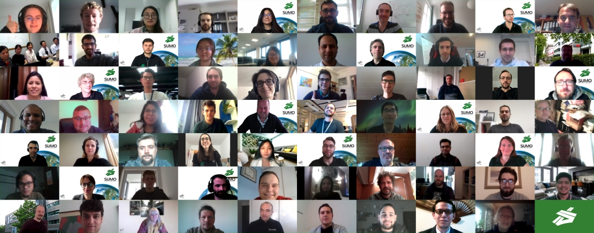

<!-- head image -->
<!--

  

 -->

**Save the Date: September 13-15, 2021**

### Introduction
Traffic simulations are of immense importance for researchers as well as practitioners in the field of transportation. SUMO has been available since 2001 and provides a wide range of traffic planning and simulation applications. SUMO consists of a suite of tools covering road network imports and enrichment, demand generation and assignment, and a state-of-the-art microscopic traffic simulator capable of simulating private and public transport modes, as well as person-based trip chains. Being open source, SUMO is easily extensible by new behavioral models and can be dynamically controlled via a well-defined programming interface. These and other features make SUMO one of the most often used open source traffic simulators with a large and international user community.

### Call for Papers
The conference focuses on presenting new and unique results in the field of mobility simulation and modeling using openly available tools and data. We expect a large variety of research topics and usage approaches. If you are working on a research project fitting the topics below, you are kindly invited to submit an abstract. Possible areas of interest include (but are not limited to):

- Mobility and Demand Modelling
- Traffic Simulation
- Open Tools and Open Data
- Modelling Urban Mobility
- Traffic Applications
- Traffic Management Solutions
- Intermodal Transport
- Autonomous Driving
- Logistics Simulation
- Vehicular Communication
- E-Mobility
- Reinforcement learning / Machine Learning

### Paper Submission
***Attention***: We changed our paper submission process. We are now offering two submission types:

1) Scientific Papers:

- All accepted scientific papers must be presented at the conference.
- Scientific papers will be reviewed by at least 2 reviewers.
- All accepted scientific papers will be published in the SUMO proceedings.
- Scientific papers must be submitted in LaTeX or Word format before midnight, **Monday, May 3rd, 2021**.
- Scientific papers should be between 5 and 20 pages long.

2) Technical Presentations:

- The SUMO conference gives the opportunity to present your topic during the poster session or an oral short presentation.
- There is no need to write a scientific paper.
- Possible technical presentations can be:
  - Results of Bachelor or Master theses
  - Live Demos
  - SUMO Use Cases
  - Project Presentations
  - Work in Progress which would benefit from the feedback of other SUMO users
- Title and a short abstract (300 words) must be submitted until **Monday, May 3rd, 2021**.

#### Submission Link

Please submit your papers via EasyChair:
https://easychair.org/conferences/?conf=sumo2021

### Important Dates
- Paper and Abstract Submission Deadline: **Monday, May 3rd, 2021**.
- Notification of Acceptance:  **End of June, 2021**.
- Camera Ready version due: **Monday, July 19th, 2021**.

<!-- ### Agenda

*Schedule given in Central European Time (CET) (UTC+1)* -->

<!--
| Monday         |October 26, 2020|
|----------------|---|
| 13:00 - 14:00  | Opening & Tutorial  |
| 14:30 - 15:00  | Ask us anything  |
| 15:00 - 15:30  | openMobility   |

 

| Tuesday        | October 27, 2020 |
|----------------|---|
| 09:00 - 10:00  | Session 1  |
| 10:30 - 11:30  | Session 2  |
| 13:00 - 14:00  | Session 3  |
| 14:30 - 15:00  | Poster Session |
| 15:00 - 15:30  | Poster Session |
| 15:30 - 16:00  | Poster Session |
| 16:00 - 16:30  | Poster Session |
| 17:00          | [Social Event](#social-event) |

 

| Wednesday      | October 28, 2020  |
|----------------|---|
| 09:00 - 10:00  | Session 4  |
| 10:30 - 11:30  | Keynote  |
| 13:00 - 14:00  | Session 5  |
| 14:30 - 15:00  | Session 6 |
-->

<!-- dismissible alert -->
<!-- 

    <button type="button" class="close" data-dismiss="alert">&times;</button>
    More detailed information is coming soon

 

### Social Event

We are going to have a fun SUMO-related quiz using [Menti](https://www.menti.com/). Join our Zoom meeting and have a smartphone/tablet ready at hand. Test your knowledge of SUMO and win the glorious and prestigious prize of attaching your name to an easter egg in “sumo-gui”.

### Registration
 
The registration fee includes a two and a half day conference program with refreshments, lunch, proceedings and social events in the evening. Accommodation is not included within the registration fee and must be pre-booked separately. 
Register here. 

### Prices
Participation at this year's conference will be **free of charge**!

<!--- Regular Tickets – 495 EUR (One-Day-Ticket – 325 EUR)
- Authors and Project Partners – 275 EUR
- *"limited"* Student Grants - 75 EUR

The registration fee includes a two and a half day conference program with refreshments, lunch, proceedings, and social events in the evening. Accommodation is not included within the registration fee and must be pre-booked separately. The tickets for the conference can be booked on the following website: https://sumo2020.besl-eventservice.de.

<!-- The conference takes place in Berlin Adlershof:

**German Aerospace Center (DLR)**  
Institute of Transportation Systems  
Rutherfordstr. 2  
12489 Berlin  
Germany

<iframe width="100%" height="350" frameborder="0" scrolling="no" marginheight="0" marginwidth="0" src="https://www.openstreetmap.org/export/embed.html?bbox=13.525671958923342%2C52.42664800007926%2C13.532752990722656%2C52.42955590906348&amp;layer=mapnik&amp;marker=52.42810361404521%2C13.529212474822998" style="border: 1px solid black"></iframe> <small><a href="https://www.openstreetmap.org/?mlat=52.42810&amp;mlon=13.52921#map=18/52.42810/13.52921">View in OSM</a>  |  <a href="https://goo.gl/maps/vBLQefwTLVy9x2oU8">View in Google Maps</a></small>

### Hotel
Our hotel recommendation is:  

**Dorint Berlin-Adlershof**  
Rudower Chaussee 15  
12489 Berlin  
Tel 67822-0  
Fax 67 822-1000  
https://hotel-berlin-adlershof.dorint.com/en/  
(5-minute walk from S-Bahn station “Adlershof” to the hotel, another 7-minute walk from the hotel to DLR) -->

### Language
The conference language is English.

### Venue
Given the extraordinary situation we are facing, this year's SUMO User Conference will be **online**.   

### Contact
Please contact the conference team via mail at [sumo-conference@dlr.de](mailto:sumo-conference@dlr.de)
