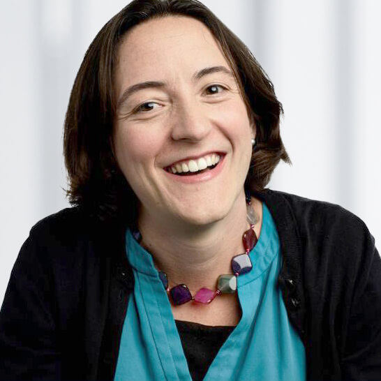
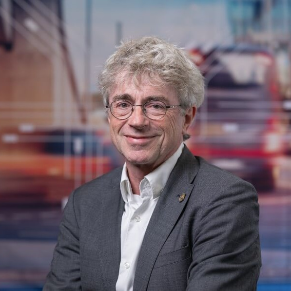

  Registration is now open: <a href="https://sumo2026.welcome-manager.de/">https://sumo2026.welcome-manager.de/</a>
   
  <small><b>Please keep in mind that the registration will close on May 15, 2026 (at 23:59 CEST).</b></small>

<!-- # Save the Date!

June 01-04, 2026, in Berlin.

The SUMO Conference, held every year in Berlin since 2013, is a must-attend event for anyone involved with SUMO. It gathers international participants from the industry, research and public institutions - to present (among others) projects, studies and advancements all around traffic, simulation and SUMO.

The conference offers opportunities to learn about new features, connect with other users, engage with the developers, exchange ideas, and even start new collaborations. -->

# Agenda

<small>&#128339; <i>Schedule given in Central European Summer Time (CEST) (UTC+2) - This agenda may be subject to change</i></small>

<table class="agenda"><thead>
  <tr>
    <th colspan="3">Monday, June 01, 2026</th>
  </tr></thead>
<tbody>
  <tr>
    <td rowspan="2">12:30 - 13:00</td>
    <td colspan="2" rowspan="2">Registration</td>
  </tr>
  <tr>
  </tr>
  <tr>
    <td>13:00 - 13:15</td>
    <td colspan="2">Opening</td>
  </tr>
  <tr>
    <td rowspan="4">13:15 - 14:15</td>
    <td colspan="2" rowspan="4"><b>SUMO Tutorial</b></td>
  </tr>
  <tr>
  </tr>
  <tr>
  </tr>
  <tr>
  </tr>
  <tr>
    <td rowspan="4">14:15 - 15:15</td>
    <td colspan="2" rowspan="4"><b>Ask us Anything</b></td>
  </tr>
  <tr>
  </tr>
  <tr>
  </tr>
  <tr>
  </tr>
  <tr>
    <td>15:15 - 15:30</td>
    <td colspan="2"><i>Coffee Break</i> &#x2615;</td>
  </tr>
  <tr>
    <td rowspan="8">15:30 - 17:30</td>
    <td rowspan="8"><small><i class="fa-solid fa-location-dot"></i> Einstein-Kabinett</small> 
    <b>Workshop 1</b> Simulating Connected and Automated Mobility <a style="color:#0645ad; cursor:pointer;" href="#workshop1">Read more <i class="fas fa-angle-down"></i></a></td>
    <td rowspan="8"><small><i class="fa-solid fa-location-dot"></i> Newton-Kabinett</small> 
    <b>Workshop 2</b> Navigating Complexity: Leveraging SUMO for Traffic Planning at Major Events <a style="color:#0645ad; cursor:pointer;" href="#workshop2">Read more <i class="fas fa-angle-down"></i></a></td>
  </tr>
  <tr>
  </tr>
  <tr>
  </tr>
  <tr>
  </tr>
  <tr>
  </tr>
  <tr>
  </tr>
  <tr>
  </tr>
  <tr>
  </tr>
  <tr>
    <td></td>
    <td></td>
    <td></td>
  </tr>
  <tr>
    <td rowspan="10">18:30 - 21:00</td>
    <td colspan="2" rowspan="10"><b>Evening Program - Social Event</b> 
   Boat tour 
<a style="color:#0645ad; cursor:pointer;" href="#social-event">Read more <i class="fas fa-angle-down"></i></a></td>
  </tr>
  <tr>
  </tr>
  <tr>
  </tr>
  <tr>
  </tr>
  <tr>
  </tr>
  <tr>
  </tr>
  <tr>
  </tr>
  <tr>
  </tr>
  <tr>
  </tr>
  <tr>
  </tr>
</tbody></table>

<table class="agenda">
  <thead>
    <tr>
      <th colspan="3">Tuesday, June 02, 2026</th>
    </tr>
  </thead>
  <tbody>
    <tr>
      <td>09:00 - 09:15</td>
      <td colspan="2">
        <b>Opening Address</b> 
        Sascha Knake-Langhorst <i><small>(Head of Department at DLR-TS)</small></i>
        and Michael Behrisch <i><small>(SUMO Project Lead)</small></i>
      </td>
    </tr>
    <tr>
      <td>09:15 - 10:45  Session 1
        
Session chair:

      </td>
      <td colspan="2">
       <b>sumoITScontrol</b> <small>Kevin Riehl, Anastasios Kouvelas and Michail A. Makridis</small>
       

       <b>VRU-Aware GLOSA: Integrating VRUs into Green Light Optimized Speed Advisory for Right-Turn Conflicts at Signalized Intersections</b> <small>Pushkar Mahajan, Anna-Lena Schlamp and Stefanie Schmidtner</small>
       

       <b>Radar-Based Evaluation of Car-Following Behavior and Fuel Consumption Across Vehicle Categories in SUMO</b> <small>Joshua Bittle and Mahdi Al Abdraboh</small>
      </td>
    </tr>
    <tr>
      <td>10:45 - 11:00</td>
      <td colspan="2"><i>Coffee Break</i> ☕</td>
    </tr>
    <tr>
      <td>11:00 - 12:00  Poster Session 1</td>
      <td colspan="2">
      <ul>
        <li>Modelling approach for cargo bikes in rural areas as logistic carriers - <small>Isabel Bruns</small></li>
        <li>Smart Urban Mobility Simulation: A Case Study of Hradec Králové - <small>Michal Michna, Jan Hladěna, Kamila Štekerová, Pavel Čech</small></li>
        <li>Integrating Elevation Data in SUMO models for detailed estimation of Energy consumption by Electric Vehicle in large networks - <small>Francesco Deflorio, Matteo Ferraro, Giuseppe Calcagno, Amirehsan Charlang Bakhtyari, Lorenzo Sica, Angela Carboni</small></li>
        <li>Towards Empathic Vehicles: Simulator-Based Induction of Affective States for Emotion Recognition - <small>Niklas Fraissl et al.</small></li>
        <li>A Multi-Scenario Simulation Approach for Climate-Neutral Urban Corridors - <small>Evangelos Mintsis, S. Kontorinis, V. Mizaras, E. Mitsakis, and G. Ayfantopoulou</small></li>
        <li>Coordinate-based Lane-Specific Detector Map Matching in SUMO - <small>Niklas Gritsch, Mario Ilic, Prof. Dr.-Ing. Klaus Bogenberger </small></li>
        <li>Bridging Communities: Advancing JuPedSim for Pedestrian Dynamics and Urban Mobility Research - <small>Jette Degenhardt, Mohcine Chraibi and Ralf Leibold</small></li>
        <li>Sustainable Routing for Next-Generation Mobility: Linking Evolutionary Game Theory and SUMO - <small>Andrea Bertolini, Lorenzo Castelli </small></li>
        <li>Testing Adaptive Lane-Change Planners in Realistic Traffic: A Co-Simulation Framework using SUMO, Simulink, and RoadRunner - <small>Philipp Hafemann et al.</small></li>
        <li>Environmental Impact Analysis for a New Urban Development - <small>Aya Aly, Paulo Moura</small></li>
        <li>Network Performance Analysis of Car-Following Models and Traffic Signal Light Configurations using SUMO - <small>Arya Karnik, Mounika Raj Kavadi, Joshua Bittle</small></li>
        <li>Causality-Aware Energy Forecasting and Adaptive Task Control in Edge-Assisted Autonomous Vehicular Networks - <small>Maha Alruwaili</small></li>
        <li>Analysis and comparison of Multimodal Link Transmission Model and SUMO in urban networks - <small>Ning Xie, Meng Wang</small></li>
        <li>Instantania, the fast, parallelized traffic microsimulator for large scale transport digital twins - <small>Joerg Schweizer</small></li>
        <li>KISLEK - KI zur Steuerung verbundener Verkehrsknoten - <small>Lukas Klein</small></li>
        <li>Revisiting Mesoscopic Traffic Flow Simulation in SUMO: Limitations, Analysis, and a Link-based Alternative - <small>Ying-Chuan Ni, Alina Akopian, Anastasios Kouvelas, Michail A. Makridis</small></li>
      </ul>
      </td>
    </tr>
    <tr style="background-color:#d9f1ff">
      <td>12:00 - 13:00</td>
      <td colspan="2" style="text-align:center"><i><b>Lunch</b></i> 🥗</td>
    </tr>
    <tr>
      <td>13:00 - 14:00</td>
      <td colspan="2">
        <b>Keynote: Traffic simulation modeling: combining generative modeling with transportation science to achieve scalability</b> 
        Prof. Dr. Carolina Osorio <i><small>(Google Research and HEC Montreal)</small></i> 
        <a href="#keynote1" style="color:#0645ad;">Read more <i class="fas fa-angle-down"></i></a>
      </td>
    </tr>
    <tr>
      <td>14:00 - 14:30</td>
      <td colspan="2"><i>Coffee Break</i> ☕</td>
    </tr>
    <!-- Parallel block -->
    <tr>
      <td>14:30 - 15:30</td>
      <td>
        <small><i class="fa-solid fa-location-dot"></i> Bunsen-Saal</small> 
        <b>Session 2</b>
        
Session chair:

         
      <b>Enabling Non-Lane-Based Cycling Behavior for Mass Bicycle Traffic Flow Simulation in SUMO</b> <small>Ying-Chuan Ni, Thomas Ramseier, Junzhe Cao, Anastasios Kouvelas and Michail Makridis </small>
       

       <b>A Cycle-Level Distribution-Based Calibration of Microscopic Intersection Models Using UAV Trajectories</b> <small>Charalambos Tsioutis, Konstantinos Pourgourides and Stelios Timotheou</small>
      </td>
      <td>
        <small><i class="fa-solid fa-location-dot"></i> Einstein-Kabinett</small> 
        <b>Workshop 3</b> 
        Digital Twins and Traffic Management in Cities 
        <a href="#workshop3" style="color:#0645ad;">Read more <i class="fas fa-angle-down"></i></a>
      </td>
    </tr>
    <tr>
      <td>15:30 - 15:45</td>
      <td colspan="2"><i>Coffee Break</i> ☕</td>
    </tr>
    <!-- Parallel continuation -->
    <tr>
      <td>15:45 - 17:30</td>
      <td>
        <small><i class="fa-solid fa-location-dot"></i> Bunsen-Saal</small> 
        <b>Session 3</b>
        
Session chair:

         
        <b>Improving SUMO for Motorcycles</b> <small>Gnanambica Chouta and Christian Facchi</small>
       

       <b>Framework for Generating Activity-Based Travel Demand Using Aggregated Mobility and Land-Use Big Data</b> <small>Joerg Schweizer, Ngoc-An Nguyen, Cristian Poliziani and Federico Rupi</small>
       

       <b>A Dynamic Traffic Calibration Framework for SUMO Based on Historical Real-World Speed Data</b> <small>Finn Guist, Andreas Freymann, Sandro Lipinski, Emanuel Reichsöllner and Mirko Sonntag</small>
      </td>
      <td>
        <small><i class="fa-solid fa-location-dot"></i> Einstein-Kabinett</small> 
        <b>(cont.) Workshop 3</b> 
        Digital Twins and Traffic Management in Cities 
        <a href="#workshop3" style="color:#0645ad;">Read more <i class="fas fa-angle-down"></i></a>
      </td>
    </tr>
    <tr>
      <td>18:00 - 20:00</td>
      <td colspan="2" style="text-align:center">
        <b>Evening Program - Barbecue</b> 🍖
      </td>
    </tr>

  </tbody>
</table>

<table class="agenda">
  <thead>
    <tr>
      <th colspan="3">Wednesday, June 03, 2026</th>
    </tr>
  </thead>
  <tbody>
  <tr>
    <td>09:00 - 10:30  Session 4 
      
Session chair:

    </td>
    <td>
    <b>Integrating Synthetic Populations and Activity Chains for Individual Emission Assessment in SUMO</b> <small>Alix NGARI LENDOYE, Corwin Fèvre, Tatiana Graindorge and Alain Bouju</small>
       

       <b>EfaSim - A Prototype for a SUMO-driven Emergency Vehicle Driving Simulator</b> <small>Rebecca Ahmed, Cristian Cubides-Herrera, Fabian Schuhmann and Markus Lienkamp</small>
       

       <b>Energy- and Emission-Conscious Extension of TAPAS-SUMO Coupling - A Case Study in Delmenhorst</b> <small>Yun-Pang Flötteröd, Michael Behrisch and Knut M. Heidemann</small>
       </td>
    <td rowspan="3">
<small><i class="fa-solid fa-location-dot"></i> Einstein-Kabinett</small> 
  <b>Workshop 4</b> (10:00 - 12:00)
   
  Using SUMO for simulating innovative public transportation systems + Using SUMO for Railway simulations 
  <a href="#workshop4" style="color:#0645ad;">Read more <i class="fas fa-angle-down"></i></a>
    </td>
  </tr>

  <tr>
    <td>10:30 - 10:45</td>
    <td><i>Coffee Break</i> ☕</td>
  </tr>

  <tr>
    <td>10:45 - 12:15  Session 5 
      
Session chair:

    </td>
    <td>
        <b>Simulation of Real DACH-Standard Traffic Signal Control Systems in SUMO</b> <small>Markus Runhao Zhou, Johann Krüger and Meng Wang</small>
       

       <b>ATSUM: An Attlas-SUMO Middleware</b> <small>Rodolfo Valentim, Tiago Pinheiro, Vincen Santaella, Artur Souza, João Cleverales, Fernando Martinelli and Víctor Martínez</small>
       

       <b>Investigating Traffic Effects of Control Transitions in Level 3 Conditional Driving with SUMO</b> <small>Robert Alms and Peter Wagner</small>
    </td>
  </tr>
    <tr style="background-color:#d9f1ff">
      <td>12:15 - 13:00</td>
      <td colspan="2" style="text-align:center"><i><b>Lunch</b></i> 🥗</td>
    </tr>
    <tr>
      <td>13:00 - 14:00  Poster Session 2</td>
      <td colspan="2">
      <ul>
      <li>QI-TraSiCo – Quantum-Inspired Traffic Signal Control - <small>Elisabeth Wagner et al.</small></li>
      <li>Intelligent Ship Traffic Management for the Port of Bremerhaven - <small>Laura Bieker-Walz et al.</small></li>
      <li>Towards Adaptive Traffic Pattern Clustering Reinforcement Learning in Traffic Signal Control - <small>Lukas Klein</small></li>
      <li>Integrating Macroscopic and Microscopic Road Traffic Simulations for Impact Assessment of Flood-Related Disruptions - <small>Amirehsan Charlang Bakhtyari, Francesco Deflorio, Matteo Ferraro, Michele Amaddii, Fabio Castelli, Chiara Arrighi</small></li>
      <li>Systematic Integration of Heterogeneous Urban Demand Data into a Microscopic SUMO Simulation - <small>Mario Ilic, Niklas Gritsch, Prof. Dr.-Ing. Klaus Bogenberger</small></li>
      <li>Realistic and Scalable Floating Car Observer Detection in SUMO Derived from Co-Simulation - <small>Jeremias Gerner, Klaus Bogenberger, and Stefanie Schmidtner </small></li>
      <li>BikeZ-ETH: Mass bicycle traffic flow simulation API and cycling trajectory dataset - <small>Thomas Ramseier, Ying-Chuan Ni, Shaimaa K. El-Baklish, Kevin Riehl, Anastasios Kouvelas, Michail A. Makridis</small></li>
      <li>LLM-Driven Agents for Evacuation Simulation in SUMO - <small>Michael Jones</small></li>
      <li>Simulation of Unknown Motion - <small>Andreas Richter et al.</small></li>
      <li>How much do emissions differ? Testing three calculation methods - <small>Addina Shafiyya Ediansjah, Jens Borken-Kleefeld, Meng Wang</small></li>
      <li>Multi-modal safety-optimized traffic management system using incident-informed rerouting and adaptive signal control: a SUMO application - <small>Nikolaos Geroliminis,
Dimitris Tsitsokas</small></li>
      <li>sumo3Dviz - A three dimensional traffic visualisation - <small>Kevin Riehl, Michail Makridis, Julius Schlapback, Anastasios Kouvelas</small></li>
      <li>Toward an Agentic AI Framework for Integrated MATSim-SUMO Policy Evaluation - <small>David Micallef, Luca Bondin, Alexiei Dingli</small></li>
      <li>Fluidity: Algorithm to infer Traffic Light Rhythms from GPS Positioning Data - <small>Gaston Laplagne</small></li>
      <!-- <li>SESAM - <small></small></li> -->
      <!-- <li>abc - <small>Sumaira Shaheen</small></li> -->
      </ul></td>
    </tr>
    <tr>
      <td>14:00 - 14:15</td>
      <td colspan="2"><i>Coffee Break</i> ☕</td>
    </tr>
    <tr>
      <td>14:15 - 15:15</td>
      <td colspan="2">
        <b>Keynote: SUMO and I – 25 years later...</b> 
        Prof. Dr. Peter Wagner <i><small>(German Aerospace Center (DLR))</small></i> 
        <a href="#keynote2" style="color:#0645ad;">Read more <i class="fas fa-angle-down"></i></a>
      </td>
    </tr>
    <tr>
      <td>15:15 - 16:00</td>
      <td colspan="2">Remarks</td>
    </tr>
    <tr>
      <td>16:00 - 16:30</td>
      <td colspan="2"><i>Conference Photo</i> 📷 + <i>Coffee Break</i> ☕</td>
    </tr>
    <tr>
      <td>16:30 - 18:00</td>
      <td colspan="2">Special Anniversary Session: Celebrating 25 years of SUMO</td>
    </tr>
    <tr>
      <td>18:00 - 19:30</td>
      <td colspan="2" style="text-align:center"><i><b>Dinner</b></i> 🥗</td>
    </tr>
  </tbody>
</table>

<table class="agenda">
  <thead>
    <tr>
      <th colspan="3">Thursday, June 04, 2026</th>
    </tr>
  </thead>
  <tbody>
    <tr>
      <td>09:00 - 10:30  Session 6 
      
Session chair:
</td>
      <td colspan="2">
      <b>Energy Optimized Green Light Assist in Varying Traffic Scenarios Using Reinforcement Learning</b> <small>Johan Kolms, Kai M. Blum, Michael Than, Tamás Kurczveil and Dirk J. Lehmann</small>
       

       <b>Reconstruction of Public Transport Routes Based on Imperfect GTFS and OpenStreetMap Data</b> <small>Alexander Kaiser and Alexander Schmaus</small>
       

       <b>Driver Models in SUMO and Elsewhere</b> <small>Peter Wagner</small>
      </td>
    </tr>
    <tr>
      <td>10:30 - 10:45</td>
      <td colspan="2"><i>Coffee Break</i> ☕</td>
    </tr>
    <tr>
      <td>10:45 - 12:15  Session 7 
      
Session chair:
</td>
      <td colspan="2">
      <b>C-ITS services for light rail systems</b> <small>Paula von der Heide</small>
       

       <b>GROSS: German Rail Open-Source SUMO Simulation</b> <small>Juri Penell and Damian Dailisan</small>
       

       <b>SUMO for Railway Applications</b> <small>Christian Rahmig, Jakob Erdmann, Jakob Geischberger and Larissa Zhuchyi</small>
      </td>
    </tr>
    <tr style="background-color:#d9f1ff">
      <td>12:15 - 13:00</td>
      <td colspan="2" style="text-align:center"><i><b>Lunch</b></i> 🥗</td>
    </tr>
    <tr>
      <td>13:00 - 13:45  Session 8 
      
Session chair:
</td>
      <td colspan="2">
             <b>Reproducing Weekly Crash Patterns Using a Minimalist Driver Error Model</b> <small>Ronald Nippold, Andreas Leich and Peter Wagner</small>
       

       <b>Towards Smarter Intersections Through Digital Twins - The Coupling of SUMO and SCENIMINI</b> <small>Yun-Pang Flötteröd, Lars Klitzke and Peter Wagner</small>
      </td>
    </tr>
    <tr>
      <td>13:45 - 14:15</td>
      <td colspan="2">Closing Session</td>
    </tr>
  </tbody>
</table>

<small>Last update: <a href="#lastMod">see end of page</a></small>

<!-- ## Ethics and Malpractice Statement

You can read our *[Publication Ethics and Publication Malpractice Statement](../documents/SUMOPublicationEthics.pdf)*, where we list the responsibilities of editors, reviewers, and authors. -->

# Important Dates

For papers:
- ✅ ~~Recommended title and abstract submission deadline: **Sunday, January 11, 2026.**~~
- ✅ ~~Paper submission deadline: **Sunday, March 01, 2026.**~~
- ✅ ~~Notification of acceptance/rejection: **First week of April 2026.**~~
- Camera-ready paper deadline: **Sunday, May 10, 2026.**

For posters:
- ✅ ~~Mandatory title and abstract submission deadline: **Sunday, March 01, 2026.**~~
- ✅ ~~Notification of acceptance/rejection: **Thursday, March 05, 2026.**~~
- Final poster upload deadline: **Sunday, May 03, 2026.**

For SUMO moments:
- ✅ ~~Description submission deadline: **Sunday, March 01, 2026.**~~
- ✅ ~~Notification of acceptance/rejection: **Monday, March 09, 2026.**~~

# Prices

- Regular Ticket: **575 EUR**
- One-Day Ticket: **350 EUR**
- Authors and Project Partners: **375 EUR**
- Students & Invited Guests: **125 EUR** (limited) *

<small>All prices excluding VAT.</small>

*Please contact us via email at [sumo-conference@dlr.de](mailto:sumo-conference@dlr.de) to request a discount code for student registration.
The availability is limited.

# Registration

Registration is now open: <a href="https://sumo2026.welcome-manager.de/">https://sumo2026.welcome-manager.de/</a>
 
<small><b>Please keep in mind that the registration will close on May 15, 2026 (at 23:59 CEST).</b></small>

  <b>Authors:</b> Paper, poster and moments authors are required to register selecting the “Author & Project Partners” category.

<!-- The registration fee includes a two and a half day conference program with refreshments, lunch, proceedings and a social event in the evening. -->
Accommodation is not included within the registration fee and must be pre-booked separately.

  <b>Non-EU nationals:</b> Please register well in advance to facilitate internal procedures and (if necessary) ensure a smooth visa application process.

<!-- # FAQ

  
Hello

  World

  
Foo

  Bar

 -->

---

# Keynotes

 <!-- hidden anchor -->
<h3><i>Traffic simulation modeling: combining generative modeling with transportation science to achieve scalability</i></h3>

 
<small style="color: lightgray">© Carolina Osorio</small>
<h6>Prof. Dr. Carolina Osorio</h6>
Staff Research Scientist, Google Research 
Full Professor, HEC Montreal 
<a href="https://www.carolinaosorio.net/" class="btn btn-sm btn-outline-info" style="margin-top:10px;">Website</a>
  

This talk presents physics-informed machine learning methods to search high-dimensional continuous spaces in a sample efficient way, with a focus on urban mobility applications. We discuss how the design of variance reduction methods for gradient estimation of generative models can accelerate convergence and robustify model training. We present how standard transportation science metrics can be used to perform physics-informed dimensionality reduction, enabling a more efficient search of high-dimensional spaces. We discuss recent advances in the use of macroscopic traffic models as metamodels for the design of digital urban mobility twins. Methods will be illustrated with case studies of various metropolitan areas. Finally, we identify research opportunities and challenges in the fields of simulation-based optimization and machine learning as applied to urban mobility problems.

About the Speaker

Osorio is a Full Professor at HEC Montreal, where Osorio holds the SCALE AI Research Chair in Artificial Intelligence for Urban Mobility and Logistics. Osorio is also a Staff Research Scientist at Google Research, where Osorio is research lead of Mobility AI. Prior to joining HEC Montreal, Osorio was a faculty at MIT for 9 years. Osorio has consulted for Alphabet's Sidewalk Labs, and has collaborated with top private and public sector, transportation and supply chain stakeholders, including Zipcar, Ford Motor Company, New York City Department of Transportation, and the San Diego planning agency SANDAG. Her research focuses on the design of ML and simulation-based optimization algorithms to tackle high-dimensional transportation problems. Osorio was recognized as an outstanding early-career engineer in the US by the National Academy of Engineering's EU-US Frontiers of Engineering Symposium, is the recipient of an MIT Technology Review EmTech Colombia TR35 Award and was on the GOOD 100 list of innovators in the category of "Minds That Are Hacking Our Surroundings for the Better". Since 2022, Osorio has been ranked yearly in the top 2% of the most cited scientists in the field of Operations Research, Transportation and Logistics.

---

 <!-- hidden anchor -->
<h3><i>SUMO and I – 25 years later...</i></h3>

 
<small style="color: lightgray">© DLR</small>
<h6>Prof. Dr. Peter Wagner</h6>
Institute of Transportation Systems 
German Aerospace Center (DLR) 
<a href="https://www.dlr.de/en/ts" class="btn btn-sm btn-outline-info" style="margin-top:10px;">Website</a>
  

This contribution begins with a brief and biased account of the origins of SUMO. Given perceived current challenges in microscopic modelling, particularly with regard to the author‘s current favorite topic of traffic safety, it outlines potential future developments centered on modelling rather than usage.

About the Speaker

Being a physicists by training, I have worked in transport for over 30 years, focusing strongly on modelling and simulation. I started out working with cellular automata as traffic simulation tools, but I have also touched most of the pillars of the 4-step algorithm, i.e. on travel demand, traffic assignment, traffic signal control, and assessment (mostly emissions). Recently, I have developed a strong focus on traffic safety, which strongly resonates with modelling and a bit of simulation, but even more so with data analysis. While I have written some papers myself, I have done more work reviewing and improving the work of others, including the students of my classes at TU Berlin and elsewhere.

---

# Workshops

During the conference, a series of workshops will take place in dedicated rooms alongside the main program. These sessions offer participants the opportunity to engage more deeply with specific topics in a smaller, interactive setting.

 <!-- hidden anchor -->
<h3>W1 Simulating Connected and Automated Mobility</h3>
<small><i class="fas fa-calendar-alt"></i> Monday June 01, 15:30 - 17:30
 
<i><i class="fa-solid fa-user-group"></i> Confirmed participation from DLR Institute of Transportation Systems, University of Trento, FZI Research Center for Information Technology</i>
  
</small>

Connected and Automated Mobility (CAM) relies on advanced and interoperable simulation frameworks to evaluate communication, cooperation, and automated driving functions in realistic traffic scenarios. This workshop presents current developments and applications based on Eclipse MOSAIC, Eclipse SUMO, Eclipse ADORe, as well as specialized CAM use cases implemented with SUMO’s libtraci interface. Short impulse talks and live demonstrations by tool developers provide practical insights into architectures, coupling strategies, and communication modeling (e.g., CAMs/CPMs, platooning). The session is designed to stimulate exchange between developers and users and to discuss integration strategies and future directions for CAM simulation toolchains.

---
 <!-- hidden anchor -->
<h3>W2 Navigating Complexity: Leveraging SUMO for Traffic Planning at Major Events</h3>
<small><i class="fas fa-calendar-alt"></i> Monday June 01, 15:30 - 17:30
 
<i><i class="fa-solid fa-user-group"></i> Confirmed participation from Accurate, DLR Institute of Transportation Systems, Forschungszentrum Jülich, University of Wuppertal, University of Regensburg</i>
  
</small>

Large-scale events create complex interactions between vehicular traffic and pedestrian flows that require holistic planning tools. This workshop explores the added value of coupling SUMO with JuPedSim to simulate both road networks and crowd dynamics simultaneously. We will discuss specific needs, data requirements, and pitfalls faced by authorities, event organizers, and transport providers in this context. Through interactive discussion, participants will collaboratively define best practices for using multi-modal simulation in approval workflows and operational planning.

---
 <!-- hidden anchor -->
<h3>W3 Digital Twins and Traffic Management in Cities</h3>
<small><i class="fas fa-calendar-alt"></i> Tuesday June 02, 15:30 - 17:30
 
<i><i class="fa-solid fa-user-group"></i> Confirmed participation from BearingPoint, Berliner Wasserbetriebe, City of Bratislava, Eclipse Foundation, Infrest GmbH, City of Mannheim, City of München, City of Ulm, Tracasa Instrumental, Transcality</i>
  
</small>

This 2-hour workshop explores the potential of Digital Twins in urban traffic management. Participants will learn how real-time data integration and simulation models enable more adaptive, data-driven mobility systems. Interactive demonstrations highlight smart city case studies that use Digital Twins to optimise traffic flow, reduce environmental impact, and enhance safety. The session concludes with a discussion on technical challenges, scalability, and future directions within the SUMO ecosystem - defining practical next steps for intelligent urban mobility.

---
 <!-- hidden anchor -->
<h3>W4 Using SUMO for simulating innovative public transportation systems + Using SUMO for Railway simulations</h3>
<small><i class="fas fa-calendar-alt"></i> Wednesday June 03, 10:00 - 12:00
<!--  
<i><i class="fa-solid fa-user-group"></i> Confirmed participation from </i> -->
  
</small>

Traffic simulation serves as a critical tool for convincing technical experts and communities to pursue different paths in enhancing public transportation systems. SUMO supports this mission with the ability to model rail, road, and water-based transportation modes, importing existing networks and schedules while allowing flexible editing. The resulting simulations capture the complete trip chain of passengers, revealing bottlenecks and accumulating delays caused by congestion on roads as well as on train platforms, and exploring strategies to mitigate them.

SUMO further supports signal infrastructure models, train dynamics, and automated operational response mechanisms such as overtaking, track changes, and stop cancellations. This workshop aims to evaluate the strengths and limitations of SUMO's current features in the context of railway research, strategic planning, and operational decision-making. Participants will discuss which new modes still require better coverage and how existing capabilities align with emerging simulation needs.

The goal is to share insights, inspire new projects, and collectively shape the future development trajectory of SUMO for public transportation applications.

---

# Social Event

  

    

      
    

    <small style="color: lightgray">Image: <a style="color:inherit" href="https://www.reederei-kutzker.de/">© Reederei Kutzker</a></small>
  

  

  <h3 class="mt-0">Boat Tour</h3>
<small><i class="fas fa-calendar-alt"></i> Monday June 01, 18:15 - 21:00</small>
  
We'll set off from Ernst-Ruska-Ufer and navigate the Teltowkanal, Dahme, and Müggelspree, arriving at the Müggelsee - Berlin's largest lake. After spending some time on the lake, the journey will then loop back to our original starting point.
  
<b>Limited capacity.</b>
During registration, you will be asked to indicate whether you plan to attend the social event.
Please note that your response is non-binding and serves only to help us estimate attendance - it does not guarantee a reserved spot.
  

# Language

The conference language is English.

# Venue

**WISTA Event Center - "Bunsen-Saal"** <small><a target="_blank" href="https://conventions.wista.de/en/rooms-locations#c5292">Website <i class="fa-solid fa-square-arrow-up-right"></i></a></small>   
Volmerstraße 2   
12489 Berlin   
Germany

<small style="color: lightgray">Images: © WISTA Management GmbH</small>
  

    

      

        
      

    

    

      

        
      

    

    

      

        
      

    

  

<iframe width="100%" height="350" src="https://www.openstreetmap.org/export/embed.html?bbox=13.533085584640505%2C52.42993042332849%2C13.536626100540163%2C52.43153965365014&amp;layer=mapnik&amp;marker=52.43073504583373%2C13.534855842590332" style="border: 1px solid black"></iframe>

<small>View in: <a target="_blank" href="https://www.openstreetmap.org/?mlat=52.430735&amp;mlon=13.534856#map=19/52.430735/13.534856">OSM <i class="fa-solid fa-square-arrow-up-right"></i></a> - <a target="_blank" href="https://maps.app.goo.gl/iD5ahnSaGRGvpTcP7">Google Maps <i class="fa-solid fa-square-arrow-up-right"></i></a> - <a target="_blank" href="https://maps.apple/p/S~s11mzEKLQ1Am">Apple Maps <i class="fa-solid fa-square-arrow-up-right"></i></a></small>

# Contact

For questions or comments, please contact the conference team at [sumo-conference@dlr.de](mailto:sumo-conference@dlr.de).
