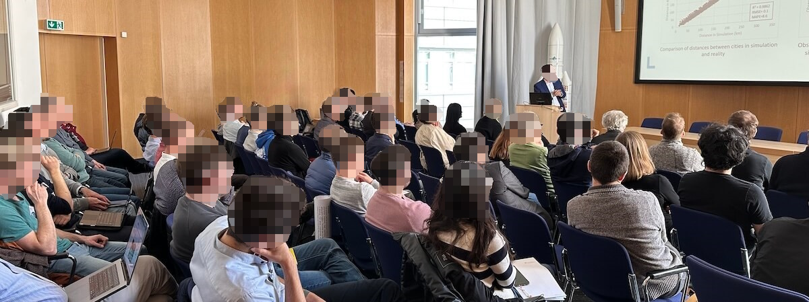
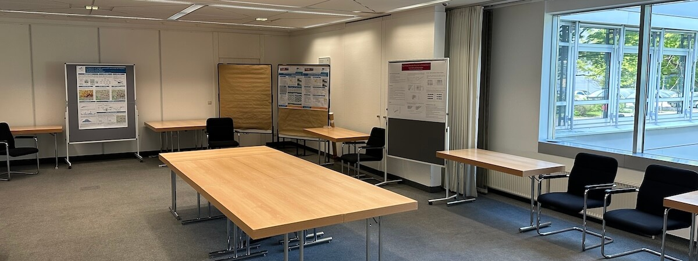

  Registration is now open: <a href="https://sumo2026.welcome-manager.de/">https://sumo2026.welcome-manager.de/</a>
   
  <small><b>Please keep in mind that the registration will close on May 15, 2026 (at 23:59 CEST).</b></small>

# Save the Date!

June 01-04, 2026, in Berlin.

The SUMO Conference, held every year in Berlin since 2013, is a must-attend event for anyone involved with SUMO. It gathers international participants from the industry, research and public institutions - to present (among others) projects, studies and advancements all around traffic, simulation and SUMO.

The conference offers opportunities to learn about new features, connect with other users, engage with the developers, exchange ideas, and even start new collaborations.

<!--
# Call for Papers

The conference focuses on presenting new and unique results in the field of mobility simulation and modelling using openly available tools and data. We expect a large variety of research topics and usage approaches.
Possible areas of interest include (but are not limited to):

- AI-based traffic modelling / AI-assisted simulation
- Data-driven calibration and validation
- Intermodal transport and shared mobility
- Simulation for traffic safety and risk assessment
- Real-time traffic prediction and control
- Large-scale simulation and high-performance computing
- Mobility and demand modelling
- Open tools and open data
- Traffic management solutions
- Sustainable urban traffic planning
- Autonomous driving
- Goods traffic and logistics simulation
- Digital twins in Intelligent transportation systems
- E-Mobility
- Vehicular communication

# Submissions

This year, there are three types of submission:

---

**1. Scientific Papers**
   - All accepted scientific papers must be presented at the conference.
   - Papers will be reviewed by at least two reviewers.
   - All accepted papers will be published in the [SUMO Conference Proceedings (SCP)](https://www.tib-op.org/ojs/index.php/scp/index).
   - Papers should be 5-20 pages long.
   - ~~Recommended: Submit the title and a short abstract (up to 300 words) in advance to receive initial feedback. Do this by Sunday, January 11, 2026 - 23:59 UTC.~~

  Authors are required to use the <a href="../documents/2025-08-25_Word-template-TIB-Open-Publishing-Conference.docx">Word</a> or <a href="../documents/TIBOpenPublishing_LaTeX-template.zip">LaTeX</a> template provided by TIB Open Publishing. 
  <b>Submissions that do not adhere to the specified template will not be considered.</b>

   - **The paper must be submitted in LaTeX or Word before Sunday, ~~February 22, 2026~~ March 01, 2026 - 23:59 UTC.**

---

 

**2. Posters**
  - The SUMO conference offers the opportunity to present your work during the poster session.
  - A scientific paper is not required.
  - Posters may present:
    - Bachelor's or Master's thesis results
    - Live Demos
    - SUMO use cases
    - Project presentations
    - Work in progress that would benefit from community feedback
  - Posters must be formatted in A0 size (841 x 1189 mm / 33.1 x 46.8 in). No specific template is required.
  - We will print your poster and provide a display panel, chair, and table.
  - Changes are allowed after the submission deadline, but we cannot reprint revised posters; you will need to bring the updated version yourself.
  - You may bring a laptop or device for demos or supplementary material (please bring your own equipment).
  - **Submit the title and a short abstract (up to 300 words) by Sunday, ~~February 22, 2026~~ March 01, 2026 - 23:59 UTC.**

---

 

**3. SUMO Moments**

To celebrate 25 years of SUMO, we invite the community to share *"SUMO Moments"* - short reflections, anecdotes, or milestones from your work with the software and the people around it. These stories can highlight technical breakthroughs, memorable challenges, or personal experiences that shaped your connection to SUMO.

- You are welcome to share:
  - Your first encounter with the SUMO community - for example your first ticket, bug report, or mailing list message
  - A key moment in a research project or application where SUMO played an important role
  - A surprising result, a lesson learned, or a simulation mishap that taught you something
  - Encounters with users, developers, or collaborators who influenced your work
  - Any memory that shows what SUMO has meant to you, your project, or your career
- Contributors will be able to register under the *Authors & Project Partners* special rate.
- **Submit a description (up to 300 words) until Sunday, ~~February 22, 2026~~ March 01, 2026 - 23:59 UTC.**

Selected submissions will be featured as brief presentations during the conference as part of the 25-year anniversary program. The goal is to capture the human side of the SUMO journey - the challenges, discoveries, and community interactions that have shaped the project over the past decades.

---

## Submission links

- Paper submissions: https://www.tib-op.org/ojs/index.php/scp/about/submissions 
<small>Login or register and then click on <b>"Make a new Conference Proceedings Submission"</b>.</small>
 
- Poster submissions: Send us an E-Mail with the subject **`Poster Submission - SUMO 2026`** to sumo-conference@dlr.de. Include the title and abstract in the body of the E-Mail.
- SUMO moments: Send us an E-Mail with the subject **`SUMO Moment - SUMO 2026`** to sumo-conference@dlr.de. Include the description in the body of the E-Mail.

-->

## Ethics and Malpractice Statement

You can read our *[Publication Ethics and Publication Malpractice Statement](../documents/SUMOPublicationEthics.pdf)*, where we list the responsibilities of editors, reviewers, and authors.

# Important Dates

For papers:
- ✅ ~~Recommended title and abstract submission deadline: **Sunday, January 11, 2026.**~~
- ✅ ~~Paper submission deadline: **Sunday, March 01, 2026.**~~
- Notification of acceptance/rejection: **First week of April 2026.**
- Camera-ready paper deadline: **Sunday, May 10, 2026.**

For posters:
- ✅ ~~Mandatory title and abstract submission deadline: **Sunday, March 01, 2026.**~~
- ✅ ~~Notification of acceptance/rejection: **Thursday, March 05, 2026.**~~
- Final poster upload deadline: **Sunday, May 03, 2026.**

For SUMO moments:
- ✅ ~~Description submission deadline: **Sunday, March 01, 2026.**~~
- ✅ ~~Notification of acceptance/rejection: **Monday, March 09, 2026.**~~

# Prices

- Regular Ticket: **575 EUR**
- One-Day Ticket: **350 EUR**
- Authors and Project Partners: **375 EUR**
- Students & Invited Guests: **125 EUR** (limited) *

<small>All prices excluding VAT.</small>

*Please contact us via email at [sumo-conference@dlr.de](mailto:sumo-conference@dlr.de) to request a discount code for student registration.
The availability is limited.

# Registration

Registration is now open: <a href="https://sumo2026.welcome-manager.de/">https://sumo2026.welcome-manager.de/</a>
 
<small><b>Please keep in mind that the registration will close on May 15, 2026 (at 23:59 CEST).</b></small>

  <b>Authors:</b> Paper, poster and moments authors are required to register selecting the “Author & Project Partners” category.

<!-- The registration fee includes a two and a half day conference program with refreshments, lunch, proceedings and a social event in the evening. -->
Accommodation is not included within the registration fee and must be pre-booked separately.

  <b>Non-EU nationals:</b> Please register well in advance to facilitate internal procedures and (if necessary) ensure a smooth visa application process.

<!-- # FAQ

  
Hello

  World

  
Foo

  Bar

 -->

---

# Keynotes

<h3><i>Traffic simulation modeling: combining generative modeling with transportation science to achieve scalability</i></h3>

 
<small style="color: lightgray">© Carolina Osorio</small>
<h6>Prof. Dr. Carolina Osorio</h6>
Staff Research Scientist, Google Research 
Full Professor, HEC Montreal 
<a href="https://www.carolinaosorio.net/" class="btn btn-sm btn-outline-info" style="margin-top:10px;">Website</a>
  

This talk presents physics-informed machine learning methods to search high-dimensional continuous spaces in a sample efficient way, with a focus on urban mobility applications. We discuss how the design of variance reduction methods for gradient estimation of generative models can accelerate convergence and robustify model training. We present how standard transportation science metrics can be used to perform physics-informed dimensionality reduction, enabling a more efficient search of high-dimensional spaces. We discuss recent advances in the use of macroscopic traffic models as metamodels for the design of digital urban mobility twins. Methods will be illustrated with case studies of various metropolitan areas. Finally, we identify research opportunities and challenges in the fields of simulation-based optimization and machine learning as applied to urban mobility problems.

About the Speaker

Osorio is a Full Professor at HEC Montreal, where Osorio holds the SCALE AI Research Chair in Artificial Intelligence for Urban Mobility and Logistics. Osorio is also a Staff Research Scientist at Google Research, where Osorio is research lead of Mobility AI. Prior to joining HEC Montreal, Osorio was a faculty at MIT for 9 years. Osorio has consulted for Alphabet's Sidewalk Labs, and has collaborated with top private and public sector, transportation and supply chain stakeholders, including Zipcar, Ford Motor Company, New York City Department of Transportation, and the San Diego planning agency SANDAG. Her research focuses on the design of ML and simulation-based optimization algorithms to tackle high-dimensional transportation problems. Osorio was recognized as an outstanding early-career engineer in the US by the National Academy of Engineering's EU-US Frontiers of Engineering Symposium, is the recipient of an MIT Technology Review EmTech Colombia TR35 Award and was on the GOOD 100 list of innovators in the category of "Minds That Are Hacking Our Surroundings for the Better". Since 2022, Osorio has been ranked yearly in the top 2% of the most cited scientists in the field of Operations Research, Transportation and Logistics.

---

<h3><i>SUMO and I – 25 years later...</i></h3>

 
<small style="color: lightgray">© DLR</small>
<h6>Prof. Dr. Peter Wagner</h6>
Institute of Transportation Systems 
German Aerospace Center (DLR) 
<a href="https://www.dlr.de/en/ts" class="btn btn-sm btn-outline-info" style="margin-top:10px;">Website</a>
  

This contribution begins with a brief and biased account of the origins of SUMO. Given perceived current challenges in microscopic modelling, particularly with regard to the author‘s current favorite topic of traffic safety, it outlines potential future developments centered on modelling rather than usage.

About the Speaker

Being a physicists by training, I have worked in transport for over 30 years, focusing strongly on modelling and simulation. I started out working with cellular automata as traffic simulation tools, but I have also touched most of the pillars of the 4-step algorithm, i.e. on travel demand, traffic assignment, traffic signal control, and assessment (mostly emissions). Recently, I have developed a strong focus on traffic safety, which strongly resonates with modelling and a bit of simulation, but even more so with data analysis. While I have written some papers myself, I have done more work reviewing and improving the work of others, including the students of my classes at TU Berlin and elsewhere.

---

# Workshops

During the conference, a series of workshops will take place in dedicated rooms alongside the main program. These sessions offer participants the opportunity to engage more deeply with specific topics in a smaller, interactive setting.

 <!-- hidden anchor -->
<h3>W1 Simulating Connected and Automated Mobility</h3>
<small><i class="fas fa-calendar-alt"></i> Monday June 01, 15:30 - 17:30
 
<i><i class="fa-solid fa-user-group"></i> Confirmed participation from DLR Institute of Transportation Systems, University of Trento</i>
  
</small>

Connected and Automated Mobility (CAM) relies on advanced and interoperable simulation frameworks to evaluate communication, cooperation, and automated driving functions in realistic traffic scenarios. This workshop presents current developments and applications based on Eclipse MOSAIC, Eclipse SUMO, Eclipse ADORe, as well as specialized CAM use cases implemented with SUMO’s libtraci interface. Short impulse talks and live demonstrations by tool developers provide practical insights into architectures, coupling strategies, and communication modeling (e.g., CAMs/CPMs, platooning). The session is designed to stimulate exchange between developers and users and to discuss integration strategies and future directions for CAM simulation toolchains.

---
 <!-- hidden anchor -->
<h3>W2 Navigating Complexity: Leveraging SUMO for Traffic Planning at Major Events</h3>
<small><i class="fas fa-calendar-alt"></i> Monday June 01, 15:30 - 17:30
 
<i><i class="fa-solid fa-user-group"></i> Confirmed participation from Forschungszentrum Jülich</i>
  
</small>

Large-scale events create complex interactions between vehicular traffic and pedestrian flows that require holistic planning tools. This workshop explores the added value of coupling SUMO with JuPedSim to simulate both road networks and crowd dynamics simultaneously. We will discuss specific needs, data requirements, and pitfalls faced by authorities, event organizers, and transport providers in this context. Through interactive discussion, participants will collaboratively define best practices for using multi-modal simulation in approval workflows and operational planning.

---
 <!-- hidden anchor -->
<h3>W3 Digital Twins and Traffic Management in Cities</h3>
<small><i class="fas fa-calendar-alt"></i> Tuesday June 02, 15:30 - 17:30
 
<i><i class="fa-solid fa-user-group"></i> Confirmed participation from Transcality, Infrest GmbH, Stadt Ulm, Stadt Mannheim, Stadt München, City of Bratislava</i>
  
</small>

This 2-hour workshop explores the potential of Digital Twins in urban traffic management. Participants will learn how real-time data integration and simulation models enable more adaptive, data-driven mobility systems. Interactive demonstrations highlight smart city case studies that use Digital Twins to optimise traffic flow, reduce environmental impact, and enhance safety. The session concludes with a discussion on technical challenges, scalability, and future directions within the SUMO ecosystem - defining practical next steps for intelligent urban mobility.

---
 <!-- hidden anchor -->
<h3>W4 Using SUMO for simulating innovative public transportation systems</h3>
<small><i class="fas fa-calendar-alt"></i> Wednesday June 03, 10:00 - 12:00
<!--  
<i><i class="fa-solid fa-user-group"></i> Confirmed participation from </i> -->
  
</small>

Traffic simulation is the major tool to convince technical people and communities alike to follow different paths in enhancing their public transportation systems. SUMO supports them with the ability to model rail, road and water based transportation modes, importing existing networks and schedules and editing them in a flexible way. The resulting simulations cover the whole trip chain of the people involved showing bottlenecks and accumulating delays due to congestion on roads but also on train platforms and how to avoid them. The topic of the workshop will be to evaluate the strengths and room for improvements of SUMO in public transportation research and which new modes still need more coverage. The goal is share insights, inspire new projects and shape the future development trajectory.

---
 <!-- hidden anchor -->
<h3>W5 Using SUMO for Railway simulations</h3>
<small><i class="fas fa-calendar-alt"></i> Thursday June 04, 10:00 - 12:00
<!--  
<i><i class="fa-solid fa-user-group"></i> Confirmed participation from </i> -->
  
</small>

SUMO supports signal infrastructure models, train dynamics and automated operational response mechanisms such as overtaking, track changes and stop cancellations. How do the current Features and Limitation fit into the simulation needs in railway research and strategic and operational planning. The goal is share insights, inspire new projects and shape the future development trajectory.

---

# Social Event

  

    

      
    

    <small style="color: lightgray">Image: <a style="color:inherit" href="https://www.reederei-kutzker.de/">© Reederei Kutzker</a></small>
  

  

  <h3 class="mt-0">Boat Tour</h3>
<small><i class="fas fa-calendar-alt"></i> Monday June 01, 18:00 - 20:30</small>
  
<b>Limited capacity.</b>
During registration, you will be asked to indicate whether you plan to attend the social event.
Please note that your response is non-binding and serves only to help us estimate attendance - it does not guarantee a reserved spot.
  

# Language

The conference language is English.

# Venue

**WISTA Event Center - "Bunsen-Saal"** <small><a target="_blank" href="https://conventions.wista.de/en/rooms-locations#c5292">Website <i class="fa-solid fa-square-arrow-up-right"></i></a></small>   
Volmerstraße 2   
12489 Berlin   
Germany

<small style="color: lightgray">Images: © WISTA Management GmbH</small>
  

    

      

        
      

    

    

      

        
      

    

    

      

        
      

    

  

<iframe width="100%" height="350" src="https://www.openstreetmap.org/export/embed.html?bbox=13.533085584640505%2C52.42993042332849%2C13.536626100540163%2C52.43153965365014&amp;layer=mapnik&amp;marker=52.43073504583373%2C13.534855842590332" style="border: 1px solid black"></iframe>

<small>View in: <a target="_blank" href="https://www.openstreetmap.org/?mlat=52.430735&amp;mlon=13.534856#map=19/52.430735/13.534856">OSM <i class="fa-solid fa-square-arrow-up-right"></i></a> - <a target="_blank" href="https://maps.app.goo.gl/iD5ahnSaGRGvpTcP7">Google Maps <i class="fa-solid fa-square-arrow-up-right"></i></a> - <a target="_blank" href="https://maps.apple/p/S~s11mzEKLQ1Am">Apple Maps <i class="fa-solid fa-square-arrow-up-right"></i></a></small>

# Contact

For questions or comments, please contact the conference team at [sumo-conference@dlr.de](mailto:sumo-conference@dlr.de).