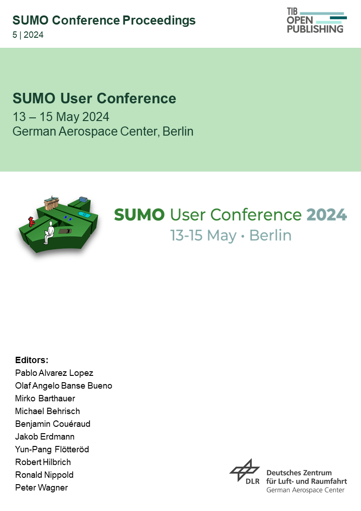

Read more information about the SUMO Conference Proceedings (SCP) Series [here](https://www.tib-op.org/ojs/index.php/scp/about).

# Proceedings
---

## Current Volume

    

      
<a href="https://www.tib-op.org/ojs/index.php/scp/issue/view/29"><strong>Vol. 5 (2024): SUMO User Conference 2024</strong></a>

      <strong>DOI:</strong> <a href="https://doi.org/10.52825/scp.v5i">https://doi.org/10.52825/scp.v5i</a>
       
      <strong>Published:</strong> July 17, 2024
    

    

    
    

## Past Volumes / Proceedings

[**Vol. 4 (2023): SUMO User Conference 2023**](https://www.tib-op.org/ojs/index.php/scp/issue/view/11)
- **DOI**: <https://doi.org/10.52825/scp.v4i>
- **Published**: June 29, 2023

 

[**Vol. 3 (2022): SUMO User Conference 2022**](https://www.tib-op.org/ojs/index.php/scp/issue/view/8)
- **DOI**: <https://doi.org/10.52825/scp.v3i>
- **Published**: September 29, 2022

 

[**Vol. 2 (2021): SUMO User Conference 2021**](https://www.tib-op.org/ojs/index.php/scp/issue/view/5)
- **DOI**: <https://doi.org/10.52825/scp.v2i>
- **Published**: June 29, 2022

 

[**Vol. 1 (2020): SUMO User Conference 2020**](https://www.tib-op.org/ojs/index.php/scp/issue/view/4)
- **DOI**: <https://doi.org/10.52825/scp.v1i>
- **Published**: June 28, 2022

 

[**SUMO 2019 - Simulating Connected Urban Mobility**](https://easychair.org/publications/volume/SUMO2019)
- EPiC Series in Computing, Vol 62
- **Published**: August 13, 2019

 

[**SUMO 2018 - Simulating Autonomous and Intermodal Transport Systems**](https://easychair.org/publications/volume/SUMO2018)
- EPiC Series in Engineering, Vol 2
- **Published**: June 25, 2018

 

[**SUMO 2017 - Towards Simulation for Autonomous Mobility**](https://elib.dlr.de/118438/1/SUMO_proceedings_online.pdf)
- Berichte aus dem DLR-Institut für Verkehrssystemtechnik, Band 31
- **Published**: May 2017

 

[**SUMO 2016 - Traffic, Mobility, and Logistics**](https://elib.dlr.de/106342/1/SUMOconference_proceedings_2016.pdf)
- Berichte aus dem DLR-Institut für Verkehrssystemtechnik, Band 30
- **Published**: May 2016

 

[**SUMO 2015 - Intermodal Simulation for Intermodal Transport**](https://elib.dlr.de/97714/1/SUMO2015_Proceeding.pdf)
- Berichte aus dem DLR-Institut für Verkehrssystemtechnik, Band 28
- **Published**: June 2015

 

[**SUMO 2014 - Modeling Mobility with Open Data**](https://elib.dlr.de/94006/1/Proceeding_SUMO2014_15%2B16May2014_Berlin-Adlershof.pdf)
- Berichte aus dem DLR-Institut für Verkehrssystemtechnik, Band 24
- **Published**: 2014

 

[**1st SUMO User Conference Proceedings**](https://elib.dlr.de/93885/1/Proceeding_SUMO2013_15-17May%202013_Berlin-Adlershof.pdf)
- Berichte aus dem DLR-Institut für Verkehrssystemtechnik, Band 21
- **Published**: 2014

# Editorial Team
---
## Editor-in-Chief
Prof. Dr. **Peter Wagner**, Institute of Transportation Systems, German Aerospace Center, Germany   
<small>[[ORCID](https://orcid.org/0000-0001-9097-8026)] [[ResearchGate](https://www.researchgate.net/profile/Peter-Wagner-14)] [[Google Scholar](https://scholar.google.de/citations?user=V5dgMqEAAAAJ&hl=en)]</small>

## Editors

- **Robert Alms**, Institute of Transportation Systems, German Aerospace Center, Germany
  <small>[[ORCID](https://orcid.org/0000-0001-9950-3596)] [[ResearchGate](https://www.researchgate.net/profile/Robert-Alms)]</small>

- **Pablo Alvarez Lopez**, Institute of Transportation Systems, German Aerospace Center, Germany
  <small>[[ORCID](https://orcid.org/0000-0002-0651-6767)] [[ResearchGate](https://www.researchgate.net/profile/Pablo-Alvarez-Lopez)]</small>

- **Olaf Angelo Banse Bueno**, Institute of Transportation Systems, German Aerospace Center, Germany
  <small>[[ORCID](https://orcid.org/0000-0001-7615-627X)] [[ResearchGate](https://www.researchgate.net/profile/Olaf-Banse-Bueno)]</small>

- Dr. **Mirko Barthauer**, Institute of Transportation Systems, German Aerospace Center, Germany
  <small>[[ORCID](https://orcid.org/0000-0003-3177-3260)] [[ResearchGate](https://www.researchgate.net/profile/Mirko-Barthauer)]</small>

- Dr. **Michael Behrisch**, Institute of Transportation Systems, German Aerospace Center, Germany
  <small>[[ORCID](https://orcid.org/0000-0002-0032-7930)] [[ResearchGate](https://www.researchgate.net/profile/Michael-Behrisch-3)]</small>

- Prof. Dr. **Laura Bieker**, Management and Information systems, Hochschule Bremerhaven, Germany
  <small>[[ORCID](https://orcid.org/0000-0002-7404-4861)] [[ResearchGate](https://www.researchgate.net/profile/Laura-Bieker-Walz)]</small>

- Prof. **Joshua Bittle**, Ph.D., College of Engineering, University of Alabama, United States
  <small>[[ORCID](https://orcid.org/0000-0003-4524-3316)] [[Website](https://sites.ua.edu/jbittle/)] [[ResearchGate](https://www.researchgate.net/profile/Joshua-Bittle)]</small>

- Dr. **Benjamin Couéraud**, Institute of Transportation Systems, German Aerospace Center, Germany
  <small>[[ORCID](https://orcid.org/0009-0001-3739-730X)] [[ResearchGate](https://www.researchgate.net/profile/Benjamin-Coueraud)]</small>

- Dr. **Jakob Erdmann**, Institute of Transportation Systems, German Aerospace Center, Germany
  <small>[[ORCID](https://orcid.org/0000-0002-4195-4535)] [[ResearchGate](https://www.researchgate.net/profile/Jakob-Erdmann-2)]</small>

- Dr. **Yun-Pang Flötteröd**, Institute of Transportation Systems, German Aerospace Center, Germany
  <small>[[ORCID](https://orcid.org/0000-0003-3620-2715)] [[ResearchGate](https://www.researchgate.net/profile/Yun-Pang-Floetteroed)]</small>

- Prof. **Alexander Hainen**, Ph.D., College of Engineering, University of Alabama, United States
  <small>[[ORCID](https://orcid.org/0000-0003-1138-9739)] [[Website](https://alexhainen.com/)]</small>

- Dr. **Robert Hilbrich**, Institute of Transportation Systems, German Aerospace Center, Germany
  <small>[[ORCID](https://orcid.org/0000-0003-3793-3982)] [[ResearchGate](https://www.researchgate.net/profile/Robert-Hilbrich)]</small>

- Prof. Dr. **Heather Kaths**, School of architecture and civil engineering, Bergische Universität Wuppertal, Germany
  <small>[[ORCID](https://orcid.org/0000-0003-2554-8243)] [[Website](https://radverkehr.uni-wuppertal.de/de/team/univ-prof-dr-ing-heather-kaths/)]</small>

- **Daniel Krajzewicz**, Institute of Transport Research, German Aerospace Center, Germany
  <small>[[ORCID](https://orcid.org/0000-0003-1045-8800)] [[ResearchGate](https://www.researchgate.net/profile/Daniel-Krajzewicz)]</small>

- Dr. **Mario Krumnow**, Traffic Solution & Innovation Management, SCHLOTHAUER & WAUER, Germany
  <small>[[ORCID](https://orcid.org/0000-0002-3356-7834)] [[ResearchGate](https://www.researchgate.net/profile/Mario-Krumnow-2)]</small>

- Dr. **Duo Li**, School of Engineering, Newcastle University, United Kingdom
  <small>[[ORCID](https://orcid.org/0000-0003-0142-9290)] [[Website](https://www.ncl.ac.uk/engineering/staff/profile/duoli.html)]</small>

- **Ronald Nippold**, Institute of Transportation Systems, German Aerospace Center, Germany
  <small>[[ORCID](https://orcid.org/0000-0003-4837-8021)] [[ResearchGate](https://www.researchgate.net/profile/Ronald-Nippold)]</small>

- Prof. Dr. **Joerg Schweizer**, Department of Civil, Chemical, Environmental, and Materials Engineering, Università di Bologna, Italy
  <small>[[ORCID](https://orcid.org/0000-0003-2289-6111)] [[Website](https://www.unibo.it/sitoweb/joerg.schweizer/cv-en)]</small>

# Ethics and Malpractice Statement
---

Read our *[Publication Ethics and Publication Malpractice Statement](../documents/SUMOPublicationEthics.pdf)*, where we list the responsibilities of editors, reviewers, and authors.

# Contact
---

The conference team can be reached at [sumo-conference@dlr.de](mailto:sumo-conference@dlr.de).